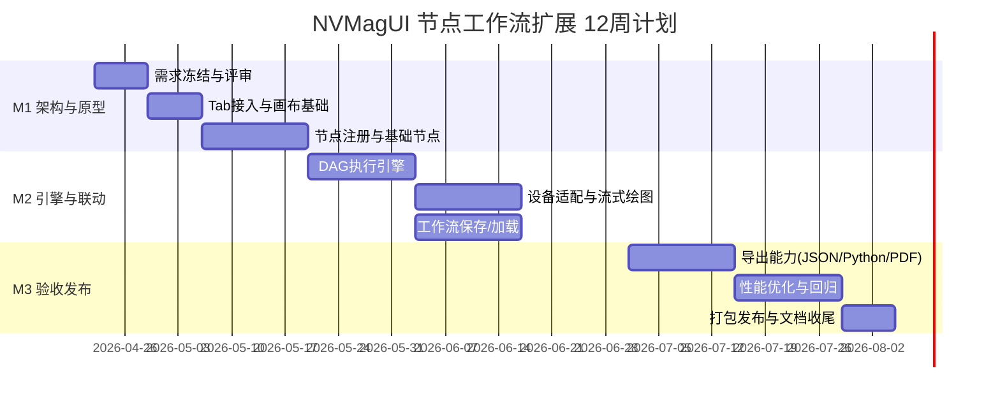

***

title: NVMagUI 自定义实验节点工作流扩展模块 开发计划周期
version: v1.0
period: 12周（建议）
---------------

# 1. 总体计划

- 开发周期：12 周
- 发布节奏：`M1 原型` -> `M2 可运行 Beta` -> `M3 正式版`
- 方法：双周迭代（每 2 周一个 Sprint）

# 2. 里程碑与交付

## M1（第1-4周）架构与可交互原型

- 完成独立模块目录与主程序 Tab 接入
- 完成节点画布基本交互（拖拽、连线、删除、缩放）
- 完成节点注册机制与 6\~8 个基础节点
- 输出：原型演示包 + 架构说明初稿

## M2（第5-8周）执行引擎与设备联动

- 完成 DAG 执行引擎（运行/停止/单步）
- 接入设备适配层（复用既有设备接口）
- 完成流式绘图节点与缓存策略
- 完成 `.nvm_workflow` 保存/加载
- 输出：Beta 版本 + 联调报告 + 使用手册初稿

## M3（第9-12周）导出能力与验收发布

- 完成导出 JSON / Python / PDF
- 性能优化（200 节点场景、10Hz 绘图）
- 回归测试（原8标签页 + 新模块）
- 发布候选版本（RC）与最终交付
- 输出：正式版、完整文档、打包程序

# 3. 周度排期（详细）

## Sprint 1（第1-2周）

- 需求冻结与方案评审
- 新 Tab 嵌入与分栏 UI 搭建
- 节点库与画布基础交互打通
- 风险清单建立

## Sprint 2（第3-4周）

- 节点基类、端口类型系统、连线校验
- 节点注册中心与首批节点实现
- 工具栏（新建/清空/保存草稿）落地
- M1 评审

## Sprint 3（第5-6周）

- DAG 构图、拓扑排序、运行状态机
- 节点执行上下文与日志事件总线
- 单步运行/停止中断机制

## Sprint 4（第7-8周）

- 设备适配层对接既有接口
- 实时流式绘图节点与刷新节流
- 工作流文件保存/加载（`.nvm_workflow`）
- M2 评审

## Sprint 5（第9-10周）

- 导出 JSON / Python
- 导出 PDF 报告模板与内容拼装
- 异常恢复与容错增强

## Sprint 6（第11-12周）

- 性能压测与优化
- 全量回归测试与缺陷清零
- 打包发布、文档终稿、验收

# 4. 角色与分工建议

- 架构/核心开发：1 人（执行引擎、序列化、适配层）
- UI 开发：1 人（画布、节点库、属性面板）
- 联调与测试：1 人（设备联调、回归、性能）
- 技术文档：0.5 人（可由开发兼任）

# 5. 验收门禁（Definition of Done）

- 不破坏原有 8 个标签页功能（回归通过）
- 新模块核心链路可用：建图 -> 运行 -> 绘图 -> 保存/加载 -> 导出
- 严重缺陷（P0/P1）清零
- 文档齐备：PRD、开发设计、用户手册、测试报告、发布说明

# 6. 风险与缓冲

## 6.1 风险项

- 设备联调时间不确定
- 旧系统接口隐式依赖难以抽离
- 高节点数量下 UI 性能波动

## 6.2 缓冲策略

- 第 8 周后预留 20% 机动时间用于联调与性能
- 每个 Sprint 固定 1 天用于回归与技术债清理
- 导出 PDF 若复杂度过高，先交付模板版并在后续迭代增强

# 7. 甘特图（Mermaid）

