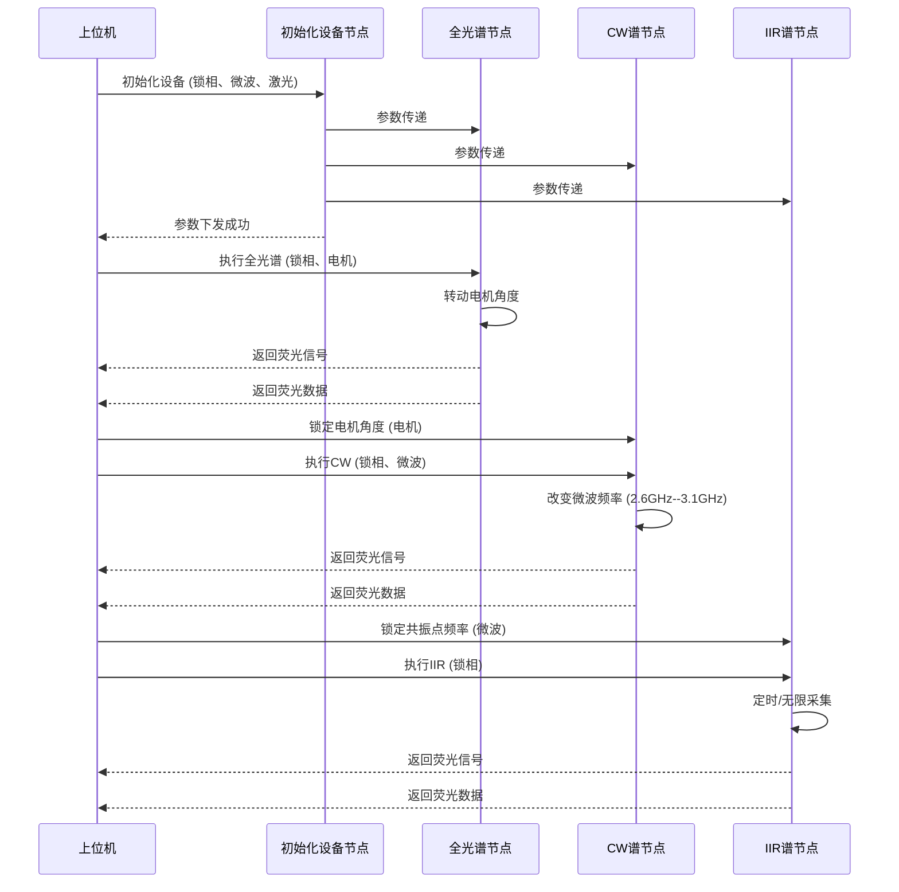

# 自动化实验节点工作流设计思路

## 1. 项目概述

本文档描述了基于现有工作流扩展模块的自定义实验节点设计思路，旨在创建一个支持CW谱、IIR谱、全光谱等实验模式的自动化节点化配置和执行。

## 2. 现有架构分析

### 2.1 工作流模块结构

```
workflow_extension/
├── workflow_tab.py          # 主工作流标签页
├── canvas.py               # 画布和节点可视化
├── engine.py               # 工作流执行引擎
├── models.py               # 数据模型定义
├── node_registry.py        # 节点注册系统
├── serializer.py           # 序列化/反序列化
├── builtins.py            # 内置基础节点
├── cw_nodes.py            # CW相关节点
└── undo_system.py         # 撤销重做系统
```

### 2.2 现有实验面板分析

#### CW谱面板 (cw\_panel.py)

- 前置条件（初始化参数）

* **核心参数**: 起始频率、结束频率、频率步进
* **数据流**: 频率扫描 → 数据采集 → 实时绘图 → 数据处理
* **输出**: 频谱数据、拟合结果、斜率计算

#### IIR谱面板 (iir\_dc\_panel.py)

- 前置条件（初始化参数）

* **核心参数**: 时间常数、采样率、共振频率
* **数据流**: 信号输入 → IIR滤波 → 直流提取 → 频谱分析
* **输出**: 滤波后数据、频谱分析结果

#### 全光谱面板 (ultra\_cw\_panel.py)

- 前置条件（初始化参数）

* **核心参数**: 起始角度、结束角度、角度步进
* **数据流**: 角度控制 → 激光采集 → 荧光检测 → 数据记录
* **输出**: 角度-荧光强度数据、激光功率数据

## 3. 设计目标

### 3.1 功能目标

- 创建可视化的实验流程配置界面
- 支持CW谱、IIR谱、全光谱实验的节点化配置
- 实现节点间的数据传递和参数联动

### 3.2 技术目标

- 基于现有workflow\_extension模块扩展
- 保持与现有Exp\_UI.py主程序的兼容性
- 支持实验参数的层次化配置
- 实现数据的实时传递和可视化

## 4. 节点设计方案

### 4.1 初始化节点 (设备管理节点)

#### 4.1.1 节点结构设计

```
初始化设备节点
├── 一级菜单：设备选择
│   ├── 锁相放大器
│   ├── 微波源
│   ├── 超声电机
│   ├── 温度计
│   └── 电源
└── 二级菜单：具体参数
    ├── 锁相放大器参数
    │   ├── 时间常数
    │   ├── 灵敏度
    │   ├── 相位设置
    │   └── 输入模式
    ├── 微波源参数
    │   ├── 频率范围
    │   ├── 功率设置
    │   ├── 调制模式
    │   └── 输出阻抗
    └── 其他设备参数...
```

#### 4.1.2 参数配置映射

基于现有General.py和配置文件结构：

```python
# 设备参数配置示例
DEVICE_CONFIG = {
    "lockin": {
        "time_constant": ["10ms", "30ms", "100ms", "300ms", "1s", "3s", "10s"],
        "sensitivity": ["2nV", "5nV", "10nV", "20nV", "50nV", "100nV"],
        "phase_range": [0, 360],
        "input_mode": ["A", "A-B", "I", "I-V"]
    },
    "microwave": {
        "freq_range": {"min": 1e6, "max": 20e9},  # 1MHz-20GHz
        "power_range": {"min": -60, "max": 20},   # dBm
        "modulation": ["AM", "FM", "PWM", "None"]
    },
    "motor": {
        "angle_range": {"min": 0, "max": 360},
        "speed_range": {"min": 0.1, "max": 10},   # deg/s
        "resolution": 0.01
    }
}
```

### 4.2 CW谱采集节点

#### 4.2.1 节点输入输出

```
输入端口:
├── device_config (设备配置) - 来自初始化节点
├── start_freq (起始频率) - MHz
├── stop_freq (结束频率) - MHz  
├── freq_step (频率步进) - MHz
└── power_level (功率设置) - dBm

输出端口:
├── freq_data (频率数组) - Hz
├── amplitude_data (幅度数据) - V
├── phase_data (相位数据) - deg
├── fit_result (拟合结果)
└── slope_data (斜率数据)
```

#### 4.2.2 参数配置

基于现有cw\_panel.py的参数结构：

```python
CW_PARAMS = {
    "frequency": {
        "start": {"type": "float", "unit": "MHz", "default": 2800},
        "stop": {"type": "float", "unit": "MHz", "default": 3000}, 
        "step": {"type": "float", "unit": "MHz", "default": 0.1}
    },
    "acquisition": {
        "dwell_time": {"type": "float", "unit": "ms", "default": 100},
        "averaging": {"type": "int", "default": 1},
        "power_level": {"type": "float", "unit": "dBm", "default": -10}
    },
    "processing": {
        "fit_method": ["linear", "polynomial", "spline"],
        "fit_points": {"type": "int", "min": 3, "max": 20, "default": 5},
        "detrend": {"type": "bool", "default": True}
    }
}
```

### 4.3 IIR谱采集节点

#### 4.3.1 节点输入输出

```
输入端口:
├── device_config (设备配置)
├── filter_config (滤波器配置)
├── sample_rate (采样率) - Hz
├── time_constant (时间常数) - s
└── dc_offset (直流偏置) - V

输出端口:
├── time_data (时间序列)
├── filtered_data (滤波后数据)
├── spectrum_data (频谱数据)
├── dc_component (直流分量)
└── ac_component (交流分量)
```

#### 4.3.2 参数配置

基于iir\_dc\_panel.py的参数：

```python
IIR_PARAMS = {
    "filter": {
        "type": ["butterworth", "chebyshev1", "chebyshev2", "elliptic"],
        "order": {"type": "int", "min": 1, "max": 10, "default": 4},
        "cutoff_freq": {"type": "float", "unit": "Hz", "default": 1000}
    },
    "acquisition": {
        "sample_rate": {"type": "float", "unit": "Hz", "default": 10000},
        "duration": {"type": "float", "unit": "s", "default": 1.0},
        "time_constant": {"type": "float", "unit": "s", "default": 0.1}
    },
    "processing": {
        "window_function": ["hanning", "hamming", "blackman", "rectangular"],
        "fft_points": {"type": "int", "default": 1024},
        "overlap_ratio": {"type": "float", "min": 0, "max": 0.9, "default": 0.5}
    }
}
```

### 4.4 全光铺采集节点

#### 4.4.1 节点输入输出

```
输入端口:
├── device_config (设备配置)
├── start_angle (起始角度) - deg
├── stop_angle (结束角度) - deg
├── angle_step (角度步进) - deg
├── laser_power (激光功率) - mW
└── detection_mode (检测模式)

输出端口:
├── angle_data (角度数组) - deg
├── fluorescence_data (荧光数据) - V
├── laser_power_data (激光功率数据) - mW
├── intensity_ratio (强度比)
└── peak_position (峰值位置)
```

#### 4.4.2 参数配置

基于ultra\_cw\_panel.py的参数：

```python
ALL_OPTICAL_PARAMS = {
    "motor": {
        "start_angle": {"type": "float", "unit": "deg", "default": 0},
        "stop_angle": {"type": "float", "unit": "deg", "default": 360},
        "step_angle": {"type": "float", "unit": "deg", "default": 1},
        "speed": {"type": "float", "unit": "deg/s", "default": 5}
    },
    "laser": {
        "power": {"type": "float", "unit": "mW", "default": 10},
        "wavelength": {"type": "float", "unit": "nm", "default": 532},
        "modulation": {"type": "bool", "default": False}
    },
    "detection": {
        "mode": ["fluorescence", "transmission", "reflection"],
        "sensitivity": {"type": "float", "unit": "V", "default": 1.0},
        "filter_wavelength": {"type": "float", "unit": "nm", "default": 650}
    }
}
```

## 5. 自动化实验节点流设计

### 5.1 基于时序图的节点流架构

根据自动化实验时序图，设计以下节点流架构：



### 5.2 节点流执行流程

#### 5.2.1 初始化阶段

**初始化设备节点**
- **功能**: 初始化锁相放大器、微波源、激光器等设备
- **输入**: 实验参数配置
- **输出**: 设备配置状态、各模块参数
- **执行流程**:
  1. 上位机发送初始化指令到初始化设备节点
  2. 初始化设备节点执行设备初始化（锁相、微波、激光）
  3. 参数传递给全光谱节点、CW谱节点、IIR谱节点
  4. 返回参数下发成功状态给上位机

#### 5.2.2 全光谱测量阶段

**全光谱节点**
- **功能**: 执行全光谱角度扫描测量
- **输入**: 设备配置、扫描参数
- **输出**: 角度-荧光强度数据
- **执行流程**:
  1. 上位机指令全光谱节点执行全光谱测量
  2. 全光谱节点内部转动电机角度
  3. 实时采集荧光信号
  4. 返回荧光信号和荧光数据给上位机

#### 5.2.3 CW频率扫描阶段

**CW谱节点**
- **功能**: 执行CW频率扫描测量
- **输入**: 设备配置、频率扫描参数
- **输出**: 频率-荧光强度数据
- **执行流程**:
  1. 上位机锁定电机角度
  2. 上位机指令CW谱节点执行CW测量
  3. CW谱节点内部改变微波频率（2.6GHz-3.1GHz）
  4. 采集不同频率下的荧光信号
  5. 返回荧光信号和荧光数据给上位机

#### 5.2.4 IIR采集阶段

**IIR谱节点**
- **功能**: 执行IIR定时/无限采集
- **输入**: 设备配置、共振频率、采集参数
- **输出**: 时间-荧光强度数据
- **执行流程**:
  1. 上位机锁定共振点频率
  2. 上位机指令IIR谱节点执行IIR采集
  3. IIR谱节点内部进行定时/无限采集
  4. 返回处理后的荧光信号给上位机

### 5.3 节点间交互关系

#### 5.3.1 参数传递机制
- 初始化设备节点向其他所有节点传递设备配置参数
- 上位机直接与各功能节点交互执行具体操作
- 节点内部完成具体的硬件控制和数据采集

#### 5.3.2 执行时序
- **串行初始化**: 初始化设备节点必须最先执行
- **并行测量**: 全光谱节点和CW谱节点可以并行执行
- **依赖执行**: IIR谱节点依赖CW谱节点的共振频率结果

#### 5.3.3 数据流向
```
上位机 → 初始化设备节点 → 全光谱/CW/IIR节点 → 上位机
```

### 5.4 节点流架构特点

1. **模块化设计**: 每个节点负责特定的实验功能
2. **参数统一管理**: 初始化设备节点统一管理设备参数
3. **直接交互**: 上位机直接与功能节点交互，减少中间层
4. **并行执行**: 支持全光谱和CW测量的并行执行
5. **依赖控制**: IIR采集依赖CW扫描的共振频率结果

## 6. 节点参数配置

**CW频率扫描节点**
- **功能**: 在固定角度下扫描微波频率
- **输入**: 锁定角度、频率范围(2.6GHz-3.1GHz)
- **输出**: 频率-荧光强度数据
- **执行流程**:
  1. 上位机锁定电机角度
  2. 指令设备执行CW测量
  3. 改变微波频率(2.6GHz-3.1GHz)
  4. 采集各频率点荧光信号
  5. 返回荧光数据

#### 5.2.4 IIR定时采集节点

**IIR定时采集节点**
- **功能**: 在共振点频率下进行定时/无限采集
- **输入**: 锁定共振频率、采集参数
- **输出**: 时域荧光信号数据
- **执行流程**:
  1. 上位机锁定共振点频率
  2. 指令设备执行IIR采集
  3. 进行定时或无限采集
  4. 实时返回处理后的荧光信号

### 5.3 节点参数配置

#### 5.3.1 初始化节点参数
```python
INIT_PARAMS = {
    "devices": {
        "lockin": {
            "time_constant": ["10ms", "30ms", "100ms", "300ms", "1s", "3s", "10s"],
            "sensitivity": ["2nV", "5nV", "10nV", "20nV", "50nV", "100nV"],
            "phase_range": [0, 360],
            "input_mode": ["A", "A-B", "I", "I-V"]
        },
        "microwave": {
            "freq_range": {"min": 2.6e9, "max": 3.1e9},  # 2.6GHz-3.1GHz
            "power_range": {"min": -60, "max": 20},       # dBm
            "modulation": ["AM", "FM", "PWM", "None"]
        },
        "laser": {
            "wavelength": 532,      # nm
            "power_range": {"min": 0.1, "max": 100},  # mW
            "stability": 0.01        # % 
        },
        "motor": {
            "angle_range": {"min": 0, "max": 360},
            "speed_range": {"min": 0.1, "max": 10},   # deg/s
            "resolution": 0.01
        }
    }
}
```

#### 5.3.2 全光谱节点参数
```python
FULL_SPECTRUM_PARAMS = {
    "scan": {
        "start_angle": {"type": "float", "unit": "deg", "default": 0},
        "stop_angle": {"type": "float", "unit": "deg", "default": 360},
        "step_angle": {"type": "float", "unit": "deg", "default": 1},
        "dwell_time": {"type": "float", "unit": "ms", "default": 100}
    },
    "acquisition": {
        "laser_power": {"type": "float", "unit": "mW", "default": 10},
        "lockin_time_constant": {"type": "string", "default": "100ms"},
        "lockin_sensitivity": {"type": "string", "default": "10nV"},
        "averaging": {"type": "int", "default": 1}
    }
}
```

#### 5.3.3 CW扫描节点参数
```python
CW_SCAN_PARAMS = {
    "frequency": {
        "start_freq": {"type": "float", "unit": "GHz", "default": 2.6},
        "stop_freq": {"type": "float", "unit": "GHz", "default": 3.1},
        "freq_step": {"type": "float", "unit": "MHz", "default": 1},
        "dwell_time": {"type": "float", "unit": "ms", "default": 50}
    },
    "motor": {
        "lock_angle": {"type": "float", "unit": "deg", "default": 0},
        "tolerance": {"type": "float", "unit": "deg", "default": 0.1}
    },
    "acquisition": {
        "microwave_power": {"type": "float", "unit": "dBm", "default": -10},
        "lockin_phase": {"type": "float", "unit": "deg", "default": 0}
    }
}
```

#### 5.3.4 IIR采集节点参数
```python
IIR_ACQUISITION_PARAMS = {
    "resonance": {
        "lock_frequency": {"type": "float", "unit": "GHz", "default": 2.87},
        "tolerance": {"type": "float", "unit": "MHz", "default": 1},
        "auto_lock": {"type": "bool", "default": True}
    },
    "acquisition": {
        "mode": ["timed", "infinite"],
        "duration": {"type": "float", "unit": "s", "default": 60},
        "sample_rate": {"type": "float", "unit": "Hz", "default": 1000},
        "time_constant": {"type": "string", "default": "100ms"}
    },
    "filter": {
        "filter_type": ["butterworth", "chebyshev1", "chebyshev2"],
        "filter_order": {"type": "int", "min": 1, "max": 8, "default": 4},
        "cutoff_freq": {"type": "float", "unit": "Hz", "default": 100}
    }
}
```

### 5.2 数据传递机制

#### 5.2.1 设备配置传递

设备配置传递是工作流系统的核心机制，确保所有实验节点使用一致的设备参数设置。

```python
# 初始化节点输出配置 - 完整设备配置结构
device_config = {
    # 锁相放大器配置
    "lockin": {
        "time_constant": "100ms",
        "sensitivity": "10nV", 
        "phase": 0,
        "input_mode": "A",
        "filter_slope": "24dB/oct",
        "reserve_mode": "High",
        "grounding": "Float"
    },
    # 微波源配置
    "microwave": {
        "frequency": 2.87e9,      # Hz
        "power": -10,             # dBm
        "modulation": "AM",
        "modulation_freq": 1000,  # Hz
        "modulation_depth": 50,   # %
        "output_impedance": 50    # Ohm
    },
    # 超声电机配置
    "motor": {
        "current_angle": 0,
        "speed": 5.0,             # deg/s
        "resolution": 0.01,       # deg
        "acceleration": 10.0,      # deg/s²
        "deceleration": 10.0,      # deg/s²
        "home_position": 0
    },
    # 温度计配置
    "thermometer": {
        "channel_count": 4,
        "sampling_rate": 10,      # Hz
        "temperature_range": [-50, 200],  # °C
        "calibration_offset": 0.0
    },
    # 电源配置
    "power_supply": {
        "voltage_limit": 30,      # V
        "current_limit": 5,       # A
        "output_mode": "CC",      # CC/CV
        "overvoltage_protection": True
    }
}
```

**配置传递特点：**

- **层次化结构**: 设备类型 → 参数类别 → 具体参数值
- **类型安全**: 包含参数类型、单位和有效范围
- **状态同步**: 实时反映设备当前状态
- **继承机制**: 子节点可继承并覆盖父节点配置

#### 5.2.2 数据流格式

标准化的数据流格式确保节点间的兼容性和数据完整性。

```python
# CW谱节点输出格式 - 完整数据结构
cw_output = {
    # 核心数据数组
    "frequency": np.array(freq_data),           # Hz - 频率数组
    "amplitude": np.array(amp_data),            # V - 幅度数组  
    "phase": np.array(phase_data),              # deg - 相位数组
    "amplitude_ref": np.array(amp_ref_data),    # V - 参考幅度
    "phase_ref": np.array(phase_ref_data),      # deg - 参考相位
    
    # 数据处理结果
    "fit_results": {
        "linear_fit": {
            "slope": slope_value,
            "intercept": intercept_value,
            "r_squared": r2_value,
            "p_value": p_value,
            "std_error": std_err
        },
        "peak_detection": {
            "peak_frequencies": peak_freqs,
            "peak_amplitudes": peak_amps,
            "peak_widths": peak_widths
        }
    },
    
    # 元数据信息
    "metadata": {
        "acquisition_time": timestamp,          # 采集时间戳
        "duration": acquisition_duration,        # 采集时长(s)
        "parameters": {
            "start_freq": start_freq,
            "stop_freq": stop_freq, 
            "freq_step": freq_step,
            "dwell_time": dwell_time,
            "averaging": averaging_count
        },
        "device_status": {
            "lockin_connected": True,
            "microwave_locked": True,
            "temperature": 25.5,                # °C
            "error_count": 0
        },
        "data_quality": {
            "snr_avg": snr_value,               # 平均信噪比
            "noise_floor": noise_level,         # 噪声基底
            "data_points": len(freq_data),
            "valid_points": valid_count
        }
    }
}

# IIR谱节点输出格式 - 时域和频域数据
iir_output = {
    # 时域数据
    "time_domain": {
        "time": np.array(time_data),             # s - 时间数组
        "raw_signal": np.array(raw_data),        # V - 原始信号
        "filtered_signal": np.array(filtered_data), # V - 滤波后信号
        "dc_component": np.array(dc_data),       # V - 直流分量
        "ac_component": np.array(ac_data)        # V - 交流分量
    },
    
    # 频域数据
    "frequency_domain": {
        "frequency": np.array(fft_freq),         # Hz - FFT频率
        "magnitude": np.array(fft_mag),         # V - 幅度谱
        "phase": np.array(fft_phase),           # rad - 相位谱
        "power_spectral_density": np.array(psd)  # V²/Hz - 功率谱密度
    },
    
    # 滤波器信息
    "filter_info": {
        "filter_type": "butterworth",
        "filter_order": 4,
        "cutoff_frequency": 1000,              # Hz
        "filter_coefficients": {
            "b": np.array(b_coeffs),
            "a": np.array(a_coeffs)
        },
        "frequency_response": {
            "magnitude_response": np.array(mag_resp),
            "phase_response": np.array(phase_resp)
        }
    },
    
    # 元数据
    "metadata": {
        "acquisition_time": timestamp,
        "sample_rate": sample_rate,              # Hz
        "duration": duration,                    # s
        "parameters": {
            "time_constant": time_constant,
            "filter_type": filter_type,
            "filter_order": filter_order
        },
        "device_status": {...},
        "data_quality": {...}
    }
}

# 全光铺节点输出格式 - 角度扫描数据
optical_output = {
    # 核心数据数组
    "angle": np.array(angle_data),              # deg - 角度数组
    "fluorescence": np.array(fluo_data),        # V - 荧光信号
    "laser_power": np.array(laser_data),       # mW - 激光功率
    "reference_signal": np.array(ref_data),     # V - 参考信号
    
    # 处理结果
    "analysis_results": {
        "intensity_ratio": np.array(intensity_ratio), # 强度比
        "normalized_fluorescence": np.array(norm_fluo), # 归一化荧光
        "peak_analysis": {
            "peak_angle": peak_angle,            # deg - 峰值角度
            "peak_intensity": peak_intensity,    # V - 峰值强度
            "fwhm": fwhm_value,                 # deg - 半高宽
            "asymmetry": asymmetry_coeff
        }
    },
    
    # 电机状态
    "motor_status": {
        "target_angles": np.array(target_angles),
        "actual_angles": np.array(actual_angles),
        "angle_error": np.array(angle_errors),   # deg - 角度误差
        "motor_speed": np.array(motor_speeds),   # deg/s - 实际速度
        "position_reached": np.array(pos_reached) # bool - 到位状态
    },
    
    # 激光状态
    "laser_status": {
        "set_power": np.array(set_powers),      # mW - 设定功率
        "actual_power": np.array(actual_powers),  # mW - 实际功率
        "power_stability": np.array(power_stability), # % - 功率稳定性
        "wavelength": 532.0,                    # nm - 激光波长
        "laser_on": True
    },
    
    # 元数据
    "metadata": {
        "acquisition_time": timestamp,
        "scan_duration": scan_duration,          # s - 扫描时长
        "parameters": {
            "start_angle": start_angle,
            "stop_angle": stop_angle,
            "step_angle": step_angle,
            "dwell_time_per_point": dwell_time,
            "laser_power": laser_power_set
        },
        "device_status": {...},
        "data_quality": {...}
    }
}
```

#### 5.2.3 数据传递协议

**数据类型标准化：**

- **数值数组**: 使用numpy.ndarray，确保数据类型一致性
- **参数字典**: 使用标准Python字典，支持嵌套结构
- **元数据**: 统一的metadata结构，包含采集信息、设备状态、数据质量

**传递机制：**

- **同步传递**: 直接函数调用，适用于小数据量
- **异步传递**: 队列机制，适用于大数据量或实时数据
- **缓存机制**: 避免重复计算，提高执行效率
- **版本控制**: 数据格式版本管理，确保兼容性

**错误处理：**

- **数据验证**: 类型检查、范围验证、完整性检查
- **异常传递**: 节点执行异常的传递和处理
- **状态反馈**: 执行状态、进度信息的实时反馈
- **回滚机制**: 执行失败时的状态回滚

## 6. 实现方案

### 6.1 基于时序图的节点注册扩展

在workflow\_extension/builtins.py中添加自动化实验节点注册：

```python
def register_automated_experiment_nodes(registry):
    """注册自动化实验相关节点"""
    
    # 初始化设备节点
    registry.register(NodeSpec(
        node_type="automated.init_devices",
        title="初始化设备",
        category="自动化实验",
        default_params=INIT_PARAMS,
        input_ports=[],
        output_ports=[
            NodePortSpec("device_config", "设备配置", "dict"),
            NodePortSpec("lockin_config", "锁相配置", "dict"),
            NodePortSpec("microwave_config", "微波配置", "dict"),
            NodePortSpec("laser_config", "激光配置", "dict"),
            NodePortSpec("motor_config", "电机配置", "dict")
        ],
        executor=_exec_automated_init_devices
    ))
    
    # 全光谱采集节点
    registry.register(NodeSpec(
        node_type="automated.full_spectrum",
        title="全光谱采集",
        category="自动化实验",
        default_params=FULL_SPECTRUM_PARAMS,
        input_ports=[
            NodePortSpec("device_config", "设备配置", "dict"),
            NodePortSpec("start_angle", "起始角度", "float"),
            NodePortSpec("stop_angle", "结束角度", "float"),
            NodePortSpec("step_angle", "角度步进", "float")
        ],
        output_ports=[
            NodePortSpec("angle_data", "角度数据", "array"),
            NodePortSpec("fluorescence_data", "荧光数据", "array"),
            NodePortSpec("motor_status", "电机状态", "dict"),
            NodePortSpec("scan_metadata", "扫描元数据", "dict")
        ],
        executor=_exec_full_spectrum_acquisition
    ))
    
    # CW频率扫描节点
    registry.register(NodeSpec(
        node_type="automated.cw_frequency_scan",
        title="CW频率扫描",
        category="自动化实验",
        default_params=CW_SCAN_PARAMS,
        input_ports=[
            NodePortSpec("device_config", "设备配置", "dict"),
            NodePortSpec("lock_angle", "锁定角度", "float"),
            NodePortSpec("start_freq", "起始频率", "float"),
            NodePortSpec("stop_freq", "结束频率", "float"),
            NodePortSpec("freq_step", "频率步进", "float")
        ],
        output_ports=[
            NodePortSpec("frequency_data", "频率数据", "array"),
            NodePortSpec("amplitude_data", "幅度数据", "array"),
            NodePortSpec("phase_data", "相位数据", "array"),
            NodePortSpec("resonance_info", "共振信息", "dict")
        ],
        executor=_exec_cw_frequency_scan
    ))
    
    # 共振频率提取节点
    registry.register(NodeSpec(
        node_type="automated.resonance_extraction",
        title="共振频率提取",
        category="自动化实验",
        default_params={},
        input_ports=[
            NodePortSpec("cw_data", "CW扫描数据", "dict"),
            NodePortSpec("resonance_info", "共振信息", "dict")
        ],
        output_ports=[
            NodePortSpec("resonance_frequency", "共振频率", "float"),
            NodePortSpec("peak_info", "峰值信息", "dict"),
            NodePortSpec("quality_factor", "品质因子", "float")
        ],
        executor=_exec_resonance_extraction
    ))
    
    # IIR定时采集节点
    registry.register(NodeSpec(
        node_type="automated.iir_acquisition",
        title="IIR定时采集",
        category="自动化实验",
        default_params=IIR_ACQUISITION_PARAMS,
        input_ports=[
            NodePortSpec("device_config", "设备配置", "dict"),
            NodePortSpec("resonance_frequency", "共振频率", "float"),
            NodePortSpec("acquisition_mode", "采集模式", "string"),
            NodePortSpec("duration", "采集时长", "float")
        ],
        output_ports=[
            NodePortSpec("time_data", "时间数据", "array"),
            NodePortSpec("signal_data", "信号数据", "array"),
            NodePortSpec("filtered_data", "滤波数据", "array"),
            NodePortSpec("acquisition_status", "采集状态", "dict")
        ],
        executor=_exec_iir_acquisition
    ))
```

### 6.2 自动化实验节点执行器

#### 6.2.1 初始化设备执行器
```python
def _exec_automated_init_devices(context, node, inputs):
    """自动化实验初始化设备执行器"""
    app = context.get("app")
    
    # 获取节点参数
    device_params = node.params.get("devices", {})
    
    # 初始化设备配置
    device_config = {}
    
    # 初始化锁相放大器
    if app and hasattr(app, 'dev') and hasattr(app.dev, 'lia'):
        lockin_params = device_params.get("lockin", {})
        app.dev.lia.set_time_constant(lockin_params.get("time_constant", "100ms"))
        app.dev.lia.set_sensitivity(lockin_params.get("sensitivity", "10nV"))
        app.dev.lia.set_phase(lockin_params.get("phase", 0))
        
        device_config['lockin'] = {
            'time_constant': lockin_params.get("time_constant"),
            'sensitivity': lockin_params.get("sensitivity"),
            'phase': lockin_params.get("phase"),
            'input_mode': lockin_params.get("input_mode", "A"),
            'initialized': True
        }
    
    # 初始化微波源
    if app and hasattr(app, 'dev') and hasattr(app.dev, 'mw'):
        mw_params = device_params.get("microwave", {})
        app.dev.mw.set_frequency(mw_params.get("frequency", 2.87e9))
        app.dev.mw.set_power(mw_params.get("power", -10))
        
        device_config['microwave'] = {
            'frequency': mw_params.get("frequency"),
            'power': mw_params.get("power"),
            'modulation': mw_params.get("modulation", "AM"),
            'freq_range': mw_params.get("freq_range", {"min": 2.6e9, "max": 3.1e9}),
            'initialized': True
        }
    
    # 初始化激光器
    if app and hasattr(app, 'dev') and hasattr(app.dev, 'laser'):
        laser_params = device_params.get("laser", {})
        app.dev.laser.set_power(laser_params.get("power", 10))
        
        device_config['laser'] = {
            'wavelength': laser_params.get("wavelength", 532),
            'power': laser_params.get("power"),
            'stability': laser_params.get("stability", 0.01),
            'initialized': True
        }
    
    # 初始化超声电机
    if app and hasattr(app, 'dev') and hasattr(app.dev, 'ultramotor'):
        motor_params = device_params.get("motor", {})
        app.dev.ultramotor.set_speed(motor_params.get("speed", 5.0))
        app.dev.ultramotor.home()
        
        device_config['motor'] = {
            'current_angle': 0,
            'speed': motor_params.get("speed"),
            'resolution': motor_params.get("resolution", 0.01),
            'angle_range': motor_params.get("angle_range", {"min": 0, "max": 360}),
            'initialized': True
        }
    
    # 参数传递给各模块
    if app and hasattr(app, 'cw_panel'):
        app.cw_panel.update_device_config(device_config)
    if app and hasattr(app, 'iir_dc_panel'):
        app.iir_dc_panel.update_device_config(device_config)
    if app and hasattr(app, 'ultra_cw_panel'):
        app.ultra_cw_panel.update_device_config(device_config)
    
    return {
        "device_config": device_config,
        "lockin_config": device_config.get('lockin', {}),
        "microwave_config": device_config.get('microwave', {}),
        "laser_config": device_config.get('laser', {}),
        "motor_config": device_config.get('motor', {}),
        "initialization_status": "success"
    }
```

#### 6.2.2 全光谱采集执行器
```python
def _exec_full_spectrum_acquisition(context, node, inputs):
    """全光谱采集节点执行器"""
    app = context.get("app")
    device_config = inputs.get("device_config", {})
    
    # 获取扫描参数
    start_angle = float(node.params.get("start_angle", 0))
    stop_angle = float(node.params.get("stop_angle", 360))
    step_angle = float(node.params.get("step_angle", 1))
    dwell_time = float(node.params.get("dwell_time", 100)) / 1000  # ms to s
    
    # 初始化数据数组
    angle_data = []
    fluorescence_data = []
    motor_status = []
    
    # 执行全光谱扫描
    if app and hasattr(app, 'dev') and hasattr(app.dev, 'ultramotor'):
        
        for angle in np.arange(start_angle, stop_angle + step_angle, step_angle):
            # 转动电机到指定角度
            app.dev.ultramotor.move_to_angle(angle)
            
            # 等待电机稳定
            time.sleep(0.1)
            
            # 采集荧光信号
            if hasattr(app.dev, 'lia'):
                # 读取锁相数据
                amplitude = app.dev.lia.read_amplitude()
                angle_data.append(angle)
                fluorescence_data.append(amplitude)
                
                # 记录电机状态
                current_angle = app.dev.ultramotor.get_angle()
                motor_status.append({
                    'target_angle': angle,
                    'actual_angle': current_angle,
                    'angle_error': abs(angle - current_angle),
                    'position_reached': abs(angle - current_angle) < 0.1
                })
            
            # 停留时间
            time.sleep(dwell_time)
    
    # 构建输出数据
    scan_metadata = {
        "start_angle": start_angle,
        "stop_angle": stop_angle,
        "step_angle": step_angle,
        "dwell_time": dwell_time * 1000,  # ms
        "total_points": len(angle_data),
        "acquisition_time": time.time(),
        "device_status": device_config
    }
    
    return {
        "angle_data": np.array(angle_data),
        "fluorescence_data": np.array(fluorescence_data),
        "motor_status": motor_status,
        "scan_metadata": scan_metadata
    }
```

#### 6.2.3 CW频率扫描执行器
```python
def _exec_cw_frequency_scan(context, node, inputs):
    """CW频率扫描节点执行器"""
    app = context.get("app")
    device_config = inputs.get("device_config", {})
    
    # 获取扫描参数
    lock_angle = float(node.params.get("lock_angle", 0))
    start_freq = float(node.params.get("start_freq", 2.6)) * 1e9  # GHz to Hz
    stop_freq = float(node.params.get("stop_freq", 3.1)) * 1e9
    freq_step = float(node.params.get("freq_step", 1)) * 1e6  # MHz to Hz
    dwell_time = float(node.params.get("dwell_time", 50)) / 1000  # ms to s
    
    # 锁定电机角度
    if app and hasattr(app, 'dev') and hasattr(app.dev, 'ultramotor'):
        app.dev.ultramotor.move_to_angle(lock_angle)
        time.sleep(0.5)  # 等待角度稳定
    
    # 初始化数据数组
    frequency_data = []
    amplitude_data = []
    phase_data = []
    
    # 执行频率扫描
    if app and hasattr(app, 'dev') and hasattr(app.dev, 'mw'):
        
        for freq in np.arange(start_freq, stop_freq + freq_step, freq_step):
            # 设置微波频率
            app.dev.mw.set_frequency(freq)
            time.sleep(0.01)  # 频率稳定时间
            
            # 采集数据
            if hasattr(app.dev, 'lia'):
                amplitude, phase = app.dev.lia.read_data()
                frequency_data.append(freq)
                amplitude_data.append(amplitude)
                phase_data.append(phase)
            
            # 停留时间
            time.sleep(dwell_time)
    
    # 分析共振信息
    resonance_info = {}
    if len(amplitude_data) > 0:
        max_amp_idx = np.argmax(amplitude_data)
        resonance_info = {
            "resonance_frequency": frequency_data[max_amp_idx],
            "peak_amplitude": amplitude_data[max_amp_idx],
            "peak_phase": phase_data[max_amp_idx],
            "quality_factor": _calculate_q_factor(frequency_data, amplitude_data)
        }
    
    return {
        "frequency_data": np.array(frequency_data),
        "amplitude_data": np.array(amplitude_data),
        "phase_data": np.array(phase_data),
        "resonance_info": resonance_info
    }

def _calculate_q_factor(frequencies, amplitudes):
    """计算品质因子Q"""
    if len(frequencies) < 3:
        return 0
    
    # 找到峰值
    peak_idx = np.argmax(amplitudes)
    peak_freq = frequencies[peak_idx]
    peak_amp = amplitudes[peak_idx]
    
    # 找到半高宽
    half_max = peak_amp / 2
    
    # 左侧半高宽点
    left_idx = peak_idx
    while left_idx > 0 and amplitudes[left_idx] > half_max:
        left_idx -= 1
    
    # 右侧半高宽点
    right_idx = peak_idx
    while right_idx < len(amplitudes) - 1 and amplitudes[right_idx] > half_max:
        right_idx += 1
    
    if right_idx > left_idx:
        fwhm = frequencies[right_idx] - frequencies[left_idx]
        return peak_freq / fwhm if fwhm > 0 else 0
    
    return 0
```

#### 6.2.4 共振频率提取执行器
```python
def _exec_resonance_extraction(context, node, inputs):
    """共振频率提取节点执行器"""
    cw_data = inputs.get("cw_data", {})
    resonance_info = inputs.get("resonance_info", {})
    
    # 从CW扫描数据中提取共振频率
    if "frequency_data" in cw_data and "amplitude_data" in cw_data:
        frequencies = cw_data["frequency_data"]
        amplitudes = cw_data["amplitude_data"]
        
        # 找到峰值位置
        if len(amplitudes) > 0:
            max_amp_idx = np.argmax(amplitudes)
            resonance_freq = frequencies[max_amp_idx]
            peak_amplitude = amplitudes[max_amp_idx]
            
            # 计算品质因子
            q_factor = _calculate_q_factor(frequencies, amplitudes)
            
            # 峰值信息
            peak_info = {
                "peak_frequency": resonance_freq,
                "peak_amplitude": peak_amplitude,
                "peak_index": max_amp_idx,
                "frequency_range": [float(frequencies.min()), float(frequencies.max())],
                "amplitude_range": [float(amplitudes.min()), float(amplitudes.max())]
            }
            
            return {
                "resonance_frequency": float(resonance_freq),
                "peak_info": peak_info,
                "quality_factor": q_factor
            }
    
    # 如果没有CW数据，使用传入的共振信息
    if "resonance_frequency" in resonance_info:
        return {
            "resonance_frequency": resonance_info["resonance_frequency"],
            "peak_info": resonance_info,
            "quality_factor": resonance_info.get("quality_factor", 0)
        }
    
    # 默认返回
    return {
        "resonance_frequency": 2.87e9,  # 默认共振频率
        "peak_info": {"status": "default"},
        "quality_factor": 0
    }
```

#### 6.2.5 IIR采集执行器
```python
def _exec_iir_acquisition(context, node, inputs):
    """IIR定时采集节点执行器"""
    app = context.get("app")
    device_config = inputs.get("device_config", {})
    
    # 获取采集参数
    resonance_freq = float(node.params.get("lock_frequency", 2.87)) * 1e9  # GHz to Hz
    acquisition_mode = node.params.get("mode", "timed")
    duration = float(node.params.get("duration", 60))
    sample_rate = float(node.params.get("sample_rate", 1000))
    
    # 锁定共振频率
    if app and hasattr(app, 'dev') and hasattr(app.dev, 'mw'):
        app.dev.mw.set_frequency(resonance_freq)
        time.sleep(0.1)  # 频率稳定时间
    
    # 初始化数据数组
    time_data = []
    signal_data = []
    filtered_data = []
    
    # 执行IIR采集
    start_time = time.time()
    sample_interval = 1.0 / sample_rate
    
    while True:
        current_time = time.time() - start_time
        
        # 检查采集结束条件
        if acquisition_mode == "timed" and current_time >= duration:
            break
        
        # 采集数据
        if app and hasattr(app.dev, 'lia'):
            signal = app.dev.lia.read_data()[0]  # 只取幅度
            time_data.append(current_time)
            signal_data.append(signal)
            
            # 简单IIR滤波
            if len(filtered_data) == 0:
                filtered_data.append(signal)
            else:
                alpha = 0.1  # 滤波系数
                filtered_signal = alpha * signal + (1 - alpha) * filtered_data[-1]
                filtered_data.append(filtered_signal)
        
        # 采样间隔
        time.sleep(sample_interval)
        
        # 无限模式检查停止条件（可通过外部信号停止）
        if acquisition_mode == "infinite" and context.get("stop_acquisition", False):
            break
    
    # 构建采集状态
    acquisition_status = {
        "mode": acquisition_mode,
        "duration": current_time if acquisition_mode == "infinite" else duration,
        "sample_count": len(time_data),
        "sample_rate": sample_rate,
        "resonance_frequency": resonance_freq,
        "acquisition_time": time.time()
    }
    
    return {
        "time_data": np.array(time_data),
        "signal_data": np.array(signal_data),
        "filtered_data": np.array(filtered_data),
        "acquisition_status": acquisition_status
    }
```

### 6.3 时序控制机制

#### 6.3.1 工作流时序管理

基于时序图的自动化实验需要精确的时序控制：

```python
class WorkflowSequenceController:
    """工作流时序控制器"""
    
    def __init__(self, workflow_executor):
        self.executor = workflow_executor
        self.sequence_queue = []
        self.current_step = 0
        self.is_running = False
        self.sequence_timer = QTimer()
        self.sequence_timer.timeout.connect(self._execute_next_step)
    
    def load_automated_sequence(self):
        """加载自动化实验序列"""
        self.sequence_queue = [
            {
                "step": 1,
                "name": "初始化设备",
                "node_type": "automated.init_devices",
                "timeout": 30,  # 秒
                "dependencies": [],
                "on_complete": self._on_init_complete
            },
            {
                "step": 2, 
                "name": "全光谱采集",
                "node_type": "automated.full_spectrum",
                "timeout": 300,  # 5分钟
                "dependencies": ["automated.init_devices"],
                "on_complete": self._on_spectrum_complete
            },
            {
                "step": 3,
                "name": "CW频率扫描", 
                "node_type": "automated.cw_frequency_scan",
                "timeout": 180,  # 3分钟
                "dependencies": ["automated.init_devices"],
                "on_complete": self._on_cw_complete
            },
            {
                "step": 4,
                "name": "共振频率提取",
                "node_type": "automated.resonance_extraction",
                "timeout": 10,  # 10秒
                "dependencies": ["automated.cw_frequency_scan"],
                "on_complete": self._on_resonance_complete
            },
            {
                "step": 5,
                "name": "IIR定时采集",
                "node_type": "automated.iir_acquisition", 
                "timeout": 120,  # 2分钟或无限
                "dependencies": ["automated.resonance_extraction"],
                "on_complete": self._on_iir_complete
            }
        ]
    
    def start_sequence(self):
        """开始执行序列"""
        if not self.sequence_queue:
            self.load_automated_sequence()
        
        self.current_step = 0
        self.is_running = True
        self._execute_next_step()
    
    def _execute_next_step(self):
        """执行下一步骤"""
        if not self.is_running or self.current_step >= len(self.sequence_queue):
            self._on_sequence_complete()
            return
        
        step = self.sequence_queue[self.current_step]
        
        # 检查依赖
        if not self._check_dependencies(step["dependencies"]):
            logging.warning(f"步骤 {step['name']} 依赖未满足，跳过")
            self.current_step += 1
            self._execute_next_step()
            return
        
        # 执行节点
        try:
            self.executor.execute_node(step["node_type"])
            
            # 设置超时
            self.sequence_timer.start(step["timeout"] * 1000)  # 转换为毫秒
            
        except Exception as e:
            logging.error(f"执行步骤 {step['name']} 失败: {e}")
            self._on_step_error(step, e)
    
    def _check_dependencies(self, dependencies):
        """检查步骤依赖"""
        for dep in dependencies:
            if not self.executor.is_node_completed(dep):
                return False
        return True
    
    def _on_init_complete(self, result):
        """初始化完成回调"""
        logging.info("设备初始化完成")
        self.current_step += 1
        self.sequence_timer.stop()
        self._execute_next_step()
    
    def _on_spectrum_complete(self, result):
        """全光谱采集完成回调"""
        logging.info("全光谱采集完成")
        self.current_step += 1
        self.sequence_timer.stop()
        self._execute_next_step()
    
    def _on_cw_complete(self, result):
        """CW扫描完成回调"""
        logging.info("CW频率扫描完成")
        self.current_step += 1
        self.sequence_timer.stop()
        self._execute_next_step()
    
    def _on_resonance_complete(self, result):
        """共振频率提取完成回调"""
        logging.info("共振频率提取完成")
        # 提取共振频率用于下一步
        if "resonance_frequency" in result:
            resonance_freq = result["resonance_frequency"]
            self._update_iir_resonance_param(resonance_freq)
        
        self.current_step += 1
        self.sequence_timer.stop()
        self._execute_next_step()
    
    def _on_iir_complete(self, result):
        """IIR采集完成回调"""
        logging.info("IIR采集完成")
        self.current_step += 1
        self.sequence_timer.stop()
        self._execute_next_step()
    
    def _update_iir_resonance_param(self, resonance_freq):
        """更新IIR节点的共振频率参数"""
        iir_node = self.executor.get_node("automated.iir_acquisition")
        if iir_node:
            iir_node.params["lock_frequency"] = resonance_freq / 1e9  # Hz转GHz
    
    def _on_sequence_complete(self):
        """序列执行完成"""
        self.is_running = False
        logging.info("自动化实验序列执行完成")
    
    def _on_step_error(self, step, error):
        """步骤执行错误处理"""
        self.is_running = False
        logging.error(f"自动化实验在步骤 {step['name']} 失败: {error}")
        # 可以选择重试或跳过
```

#### 6.3.2 设备状态同步

```python
class DeviceStateManager:
    """设备状态管理器"""
    
    def __init__(self):
        self.device_states = {
            "lockin": {"connected": False, "configured": False},
            "microwave": {"connected": False, "configured": False}, 
            "laser": {"connected": False, "configured": False},
            "motor": {"connected": False, "configured": False}
        }
        self.state_changed_callbacks = []
    
    def update_device_state(self, device, state):
        """更新设备状态"""
        if device in self.device_states:
            self.device_states[device].update(state)
            self._notify_state_change(device, state)
    
    def is_all_ready(self):
        """检查所有设备是否就绪"""
        return all(
            state["connected"] and state["configured"] 
            for state in self.device_states.values()
        )
    
    def get_device_status(self, device):
        """获取设备状态"""
        return self.device_states.get(device, {})
    
    def _notify_state_change(self, device, state):
        """通知状态变化"""
        for callback in self.state_changed_callbacks:
            callback(device, state)
```

#### 6.3.3 实时数据流控制

```python
class RealTimeDataController:
    """实时数据流控制器"""
    
    def __init__(self):
        self.data_buffers = {}
        self.data_callbacks = []
        self.is_streaming = False
        self.stream_timer = QTimer()
        self.stream_timer.timeout.connect(self._process_data_stream)
    
    def start_data_stream(self, node_type, buffer_size=1000):
        """开始数据流"""
        self.data_buffers[node_type] = {
            "buffer": deque(maxlen=buffer_size),
            "last_update": time.time()
        }
        self.is_streaming = True
        self.stream_timer.start(50)  # 20Hz更新率
    
    def add_data_point(self, node_type, data):
        """添加数据点"""
        if node_type in self.data_buffers:
            self.data_buffers[node_type]["buffer"].append({
                "data": data,
                "timestamp": time.time()
            })
            self.data_buffers[node_type]["last_update"] = time.time()
    
    def get_latest_data(self, node_type, count=1):
        """获取最新数据"""
        if node_type in self.data_buffers:
            buffer = self.data_buffers[node_type]["buffer"]
            if count == 1:
                return buffer[-1]["data"] if buffer else None
            else:
                return [point["data"] for point in list(buffer)[-count:]]
        return None
    
    def _process_data_stream(self):
        """处理数据流"""
        for node_type, buffer_info in self.data_buffers.items():
            if buffer_info["buffer"]:
                latest_data = buffer_info["buffer"][-1]
                for callback in self.data_callbacks:
                    callback(node_type, latest_data["data"])
```

### 6.4 工作流集成

#### 6.4.1 主程序集成

```python
# 在Exp_UI.py中集成自动化实验工作流
class ExperimentApp(QMainWindow):
    def __init__(self):
        super().__init__()
        # ... 现有初始化代码 ...
        
        # 添加自动化实验工作流标签页
        self.workflow_tab = WorkflowTab(app_context=self)
        self.tab_widget.addTab(self.workflow_tab, "自动化实验")
        
        # 初始化自动化实验节点
        from workflow_extension.builtins import register_automated_experiment_nodes
        register_automated_experiment_nodes(self.workflow_tab.registry)
        
        # 创建时序控制器
        self.sequence_controller = WorkflowSequenceController(self.workflow_tab.executor)
        
        # 创建设备状态管理器
        self.device_state_manager = DeviceStateManager()
        
        # 创建实时数据控制器
        self.data_controller = RealTimeDataController()
        
        # 连接信号
        self._connect_workflow_signals()
    
    def _connect_workflow_signals(self):
        """连接工作流信号"""
        # 设备状态变化
        self.device_state_manager.state_changed_callbacks.append(
            self._on_device_state_changed
        )
        
        # 数据流更新
        self.data_controller.data_callbacks.append(
            self._on_real_time_data
        )
        
        # 工作流执行状态
        self.workflow_tab.executor.node_completed.connect(
            self._on_node_completed
        )
    
    def start_automated_experiment(self):
        """启动自动化实验"""
        # 检查设备连接
        if not self._check_device_connections():
            QMessageBox.warning(self, "警告", "设备未完全连接")
            return
        
        # 启动工作流序列
        self.sequence_controller.start_sequence()
        
        # 开始数据流
        self.data_controller.start_data_stream("automated.full_spectrum")
        self.data_controller.start_data_stream("automated.cw_frequency_scan")
        self.data_controller.start_data_stream("automated.iir_acquisition")
    
    def _check_device_connections(self):
        """检查设备连接"""
        # 检查各个设备连接状态
        return (hasattr(self.dev, 'lia') and hasattr(self.dev, 'mw') and 
                hasattr(self.dev, 'ultramotor'))
    
    def _on_device_state_changed(self, device, state):
        """设备状态变化处理"""
        # 更新UI显示
        pass
    
    def _on_real_time_data(self, node_type, data):
        """实时数据处理"""
        # 更新图表显示
        if node_type == "automated.full_spectrum":
            self._update_spectrum_plot(data)
        elif node_type == "automated.cw_frequency_scan":
            self._update_cw_plot(data)
        elif node_type == "automated.iir_acquisition":
            self._update_iir_plot(data)
    
    def _on_node_completed(self, node_type, result):
        """节点完成处理"""
        logging.info(f"节点 {node_type} 执行完成")
```

```python
def _exec_init_devices(context, node, inputs):
    """初始化设备节点执行器"""
    app = context.get("app")
    
    # 获取设备配置
    device_config = {}
    
    # 从Exp_UI获取设备实例
    if app and hasattr(app, 'dev'):
        dev = app.dev
        
        # 配置锁相放大器
        if hasattr(dev, 'lia'):
            device_config['lockin'] = {
                'time_constant': node.params.get('lockin_time_constant', '100ms'),
                'sensitivity': node.params.get('lockin_sensitivity', '10nV'),
                'phase': node.params.get('lockin_phase', 0)
            }
            
        # 配置微波源
        if hasattr(dev, 'mw'):
            device_config['microwave'] = {
                'frequency': node.params.get('mw_frequency', 2.87e9),
                'power': node.params.get('mw_power', -10),
                'modulation': node.params.get('mw_modulation', 'AM')
            }
            
        # 配置超声电机
        if hasattr(dev, 'ultramotor'):
            device_config['motor'] = {
                'speed': node.params.get('motor_speed', 5.0),
                'resolution': node.params.get('motor_resolution', 0.01)
            }
    
    return {
        "device_config": device_config,
        "lockin_config": device_config.get('lockin', {}),
        "microwave_config": device_config.get('microwave', {}),
        "motor_config": device_config.get('motor', {})
    }
```

#### 6.2.2 CW谱采集执行器

```python
def _exec_cw_spectrum(context, node, inputs):
    """CW谱采集节点执行器"""
    app = context.get("app")
    device_config = inputs.get("device_config", {})
    
    # 获取参数
    start_freq = float(node.params.get("start_freq", 2800)) * 1e6  # MHz to Hz
    stop_freq = float(node.params.get("stop_freq", 3000)) * 1e6
    freq_step = float(node.params.get("freq_step", 0.1)) * 1e6
    
    # 执行CW谱采集
    frequency_data = []
    amplitude_data = []
    phase_data = []
    
    # 调用现有的CW面板逻辑
    if app and hasattr(app, 'cw_panel'):
        cw_model = app.cw_panel.model
        
        # 设置参数并启动采集
        freq_points = np.arange(start_freq, stop_freq + freq_step, freq_step)
        
        for freq in freq_points:
            # 设置微波频率
            if hasattr(app.dev, 'mw'):
                app.dev.mw.set_frequency(freq)
                time.sleep(0.01)  # 稳定时间
            
            # 采集数据
            if hasattr(app.dev, 'lia'):
                amp, phase = app.dev.lia.read_data()
                frequency_data.append(freq)
                amplitude_data.append(amp)
                phase_data.append(phase)
        
        # 数据处理
        freq_array = np.array(frequency_data)
        amp_array = np.array(amplitude_data)
        phase_array = np.array(phase_data)
        
        # 拟合处理
        fit_result = {
            "slope": 0,
            "intercept": 0,
            "r_squared": 0
        }
        
        if len(freq_array) > 5:
            from scipy.stats import linregress
            slope, intercept, r_value, p_value, std_err = linregress(freq_array, amp_array)
            fit_result = {
                "slope": slope,
                "intercept": intercept, 
                "r_squared": r_value**2,
                "p_value": p_value,
                "std_error": std_err
            }
    
    return {
        "frequency": freq_array,
        "amplitude": amp_array,
        "phase": phase_array,
        "fit_result": fit_result
    }
```

### 6.3 UI界面扩展

#### 6.3.1 参数编辑器增强

```python
class HierarchicalParamEditor(QWidget):
    """层次化参数编辑器"""
    
    def __init__(self, node_spec, parent=None):
        super().__init__(parent)
        self.node_spec = node_spec
        self._build_ui()
    
    def _build_ui(self):
        layout = QVBoxLayout()
        
        # 创建树形参数编辑器
        self.param_tree = QTreeWidget()
        self.param_tree.setHeaderLabels(["参数", "值", "单位"])
        
        # 根据节点规格创建层次化参数
        self._create_param_tree()
        
        layout.addWidget(self.param_tree)
        self.setLayout(layout)
    
    def _create_param_tree(self):
        """创建层次化参数树"""
        params = self.node_spec.default_params
        
        for category, category_params in params.items():
            category_item = QTreeWidgetItem(self.param_tree, [category, "", ""])
            category_item.setExpanded(True)
            
            for param_name, param_config in category_params.items():
                param_item = QTreeWidgetItem(category_item)
                param_item.setText(0, param_name)
                
                if isinstance(param_config, dict):
                    # 复杂参数
                    param_item.setText(1, str(param_config.get("default", "")))
                    param_item.setText(2, param_config.get("unit", ""))
                elif isinstance(param_config, list):
                    # 枚举参数
                    combo = QComboBox()
                    combo.addItems(param_config)
                    self.param_tree.setItemWidget(param_item, 1, combo)
                else:
                    # 简单参数
                    param_item.setText(1, str(param_config))
```

## 7. 数据可视化集成

### 7.1 实时数据显示

```python
class WorkflowDataDisplay(QWidget):
    """工作流数据显示组件"""
    
    def __init__(self, parent=None):
        super().__init__(parent)
        self.plot_widgets = {}
        self._build_ui()
    
    def display_node_output(self, node_id, output_data):
        """显示节点输出数据"""
        if node_id not in self.plot_widgets:
            self.plot_widgets[node_id] = self._create_plot_widget(node_id)
        
        plot_widget = self.plot_widgets[node_id]
        
        # 根据数据类型选择显示方式
        if "frequency" in output_data and "amplitude" in output_data:
            # CW谱数据
            plot_widget.plot(output_data["frequency"], output_data["amplitude"])
        elif "time" in output_data and "filtered" in output_data:
            # IIR时域数据
            plot_widget.plot(output_data["time"], output_data["filtered"])
        elif "angle" in output_data and "fluorescence" in output_data:
            # 全光铺数据
            plot_widget.plot(output_data["angle"], output_data["fluorescence"])
    
    def _create_plot_widget(self, node_id):
        """创建绘图组件"""
        plot_widget = pg.PlotWidget(title=f"节点 {node_id}")
        plot_widget.setLabel('left', '幅度', units='V')
        plot_widget.setLabel('bottom', '频率', units='Hz')
        return plot_widget
```

### 7.2 数据传递可视化

```python
class DataFlowVisualizer:
    """数据流可视化"""
    
    def __init__(self, canvas):
        self.canvas = canvas
        self.flow_animations = []
    
    def animate_data_flow(self, from_node, to_node, data_type):
        """动画显示数据流动"""
        # 创建数据流动画效果
        from_pos = from_node.scenePos()
        to_pos = to_node.scenePos()
        
        # 绘制数据流动画
        animation = QPropertyAnimation()
        animation.setDuration(1000)  # 1秒动画
        
        # 添加到画布
        self.canvas.scene.addItem(animation)
        self.flow_animations.append(animation)
```

## 8. 配置文件集成

### 8.1 设备配置文件扩展

在config/目录下创建工作流专用配置：

```ini
# config/workflow_devices.ini
[lockin]
time_constant_options = 10ms,30ms,100ms,300ms,1s,3s,10s
sensitivity_options = 2nV,5nV,10nV,20nV,50nV,100nV
phase_range_min = 0
phase_range_max = 360
input_modes = A,A-B,I,I-V

[microwave]
freq_min = 1000000
freq_max = 20000000000
freq_unit = Hz
power_min = -60
power_max = 20
power_unit = dBm
modulation_modes = AM,FM,PWM,None

[motor]
angle_min = 0
angle_max = 360
angle_unit = deg
speed_min = 0.1
speed_max = 10
speed_unit = deg/s
resolution = 0.01
```

### 8.2 实验参数配置

```ini
# config/workflow_experiments.ini
[cw_spectrum]
default_start_freq = 2800
default_stop_freq = 3000
default_freq_step = 0.1
freq_unit = MHz
default_power = -10
power_unit = dBm

[iir_spectrum]
default_sample_rate = 10000
sample_rate_unit = Hz
default_time_constant = 0.1
time_constant_unit = s
default_filter_order = 4
filter_types = butterworth,chebyshev1,chebyshev2,elliptic

[all_optical]
default_start_angle = 0
default_stop_angle = 360
angle_unit = deg
default_angle_step = 1
default_laser_power = 10
laser_power_unit = mW
```

## 9. 实施计划

### 9.1 第一阶段：基础节点实现

1. 实现初始化设备节点
2. 实现CW谱采集节点基础功能
3. 完成节点间数据传递机制
4. 集成到现有workflow\_tab.py

### 9.2 第二阶段：完整节点集

1. 实现IIR谱采集节点
2. 实现全光铺采集节点
3. 添加数据处理和分析节点
4. 完善参数配置界面

### 9.3 第三阶段：可视化增强

1. 实现实时数据显示
2. 添加数据流动画效果
3. 完善节点连接可视化
4. 优化用户交互体验

### 9.4 第四阶段：功能完善

1. 添加工作流保存/加载功能
2. 实现工作流模板系统
3. 添加错误处理和日志记录
4. 性能优化和测试

## 10. 技术要点

### 10.1 数据传递机制

- 使用numpy数组传递数值数据
- 使用字典传递复杂参数配置
- 实现数据类型检查和转换
- 支持异步数据传递

### 10.2 参数配置系统

- 层次化参数结构
- 动态参数验证
- 参数依赖关系处理
- 配置文件热加载

### 10.3 错误处理

- 节点执行异常捕获
- 设备连接状态检查
- 参数有效性验证
- 用户友好的错误提示

### 10.4 性能优化

- 数据传递缓存机制
- 异步执行支持
- 内存使用优化
- 实时显示性能优化

