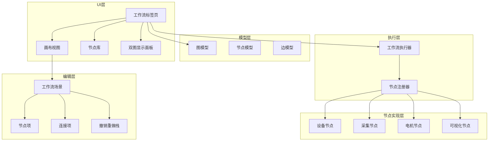
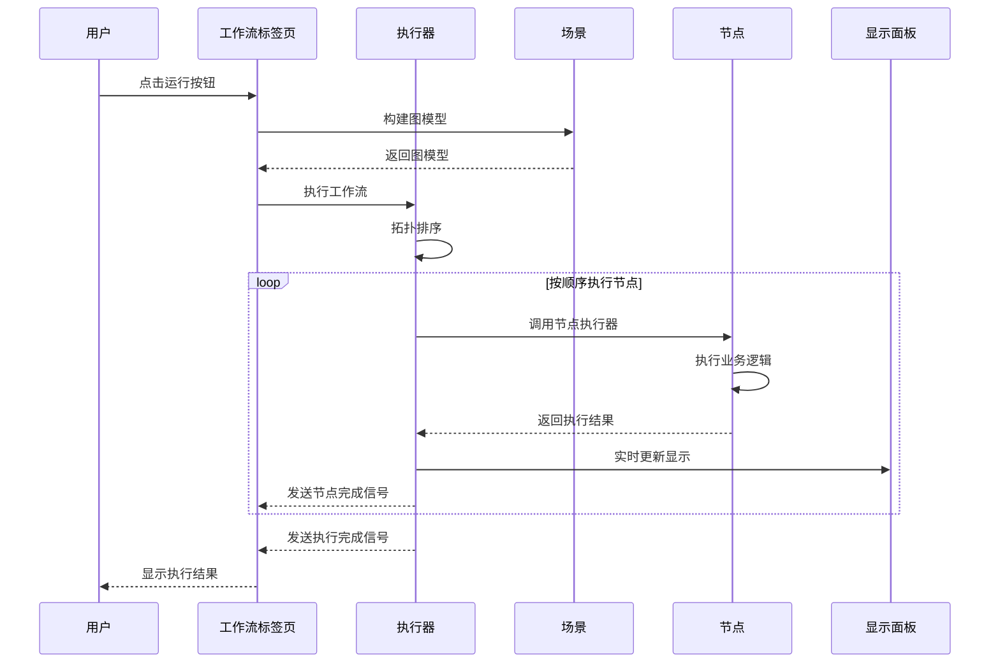

# 自定义实验 - 节点工作流系统

## 系统概述

本系统提供了一个基于节点的可视化工作流编辑器，用于构建和执行自动化实验流程。用户可以通过拖拽节点、配置参数、连接端口来创建复杂的工作流，实现设备控制、数据采集、数据处理和可视化等功能。

## 功能特性

### 核心功能
- **可视化节点编辑器**：拖拽式节点编辑，直观构建工作流
- **参数配置**：节点参数支持多种编辑器（文本、数字、选择、布尔等）
- **端口连接**：类型安全的端口连接系统，支持数据流传递
- **实时执行**：工作流实时执行，支持停止和状态监控
- **实时数据可视化**：采集节点实时更新双图显示面板
- **可拉伸布局**：工作流双图显示区域支持自由拉伸调整

### 节点分类
系统提供以下节点分类：
- **设备**：设备选择、设备初始化
- **全光谱数据采集**：全光谱采集节点
- **CW谱数据采集**：CW谱采集节点
- **IIR谱数据采集**：IIR谱采集节点
- **数据可视化**：数据显示节点

## 系统架构

### 系统架构图



### 数据传输层次结构

workflow_extension自定义实验-节点工作流系统采用分层架构进行数据传输，各层职责清晰：

```
┌─────────────────────────────────────────────────────────────┐
│  1. UI显示层 (workflow_tab.py + pyqtgraph)                   │
│     - 负责数据可视化渲染                                      │
│     - 提供用户交互界面                                        │
│     - 接收工作流执行结果并显示                                │
└─────────────────────────────────────────────────────────────┘
                              ↓
┌─────────────────────────────────────────────────────────────┐
│  2. 工作流层 (workflow_extension)                            │
│     - WorkflowExecutor: 节点执行引擎，拓扑排序                │
│     - 节点执行器: 调用设备接口获取数据                        │
│     - 端口连接: 节点间数据传递                                │
│     - 数据模型: WorkflowNodeModel, WorkflowEdgeModel          │
└─────────────────────────────────────────────────────────────┘
                              ↓
┌─────────────────────────────────────────────────────────────┐
│  3. Python封装层 (manager.py + interface/)                   │
│     - manager.py: 设备管理器，统一设备接口                    │
│     - interface/: 各种设备的Python驱动封装                    │
│     - ctypes/FFI: Python与C库互操作                         │
└─────────────────────────────────────────────────────────────┘
                              ↓
┌─────────────────────────────────────────────────────────────┐
│  4. C/C++驱动层 (DLL/SO动态链接库)                            │
│     - USBAPI_x64.dll: USB通信驱动                            │
│     - libusb-1.0.dll: USB协议栈                              │
│     - 厂商SDK: 硬件厂商提供的C/C++开发包                       │
└─────────────────────────────────────────────────────────────┘
                              ↓
┌─────────────────────────────────────────────────────────────┐
│  5. 硬件设备层                                                │
│     - 锁相放大器 (LIA_Mini_DoubleMW)                          │
│     - 微波源                                                 │
│     - 超声电机 (USM20)                                       │
│     - 激光器                                                 │
└─────────────────────────────────────────────────────────────┘
```

**各层详细说明：**

**1. UI显示层**
- 文件：`workflow_tab.py`, `cw_panel.py`, `iir_panel.py`
- 技术栈：PySide6, pyqtgraph
- 职责：将采集的数据渲染到双图显示面板，提供用户交互
- 数据接收：通过Qt信号槽机制接收工作流执行结果

**2. 工作流层**
- 文件：`workflow_extension/` 目录下所有文件
- 核心组件：
  - `engine.py`: WorkflowExecutor执行引擎，负责节点执行顺序（拓扑排序）
  - `node/cw_nodes.py`: CW谱采集节点
  - `node/data_visualization_nodes.py`: 数据显示节点
  - `node/device_init_node.py`: 设备初始化节点
  - `node/device_select_nodes.py`: 设备选择节点
  - `models.py`: 数据模型（WorkflowNodeModel, WorkflowEdgeModel, WorkflowGraphModel）
- 职责：管理节点执行顺序，处理节点间数据传递，提供可视化编辑界面
- 数据传递：通过端口连接和字典传递

**3. Python封装层**
- 文件：`manager.py`, `interface/` 目录
- 技术栈：Python, ctypes
- 职责：为上层提供统一的Python接口，隐藏底层实现细节
- 设备驱动：
  - `interface/Lockin/LIA_Mini_DoubleMW.py`: 锁相放大器驱动
  - `interface/Ultramotor_USM20.py`: 超声电机驱动
  - 其他设备驱动文件

**4. C/C++驱动层**
- 文件：`interface/Lockin/usblib/module_64/*.dll`, `*.so`
- 技术栈：C/C++, USB协议
- 职责：直接与硬件设备通信，实现硬件抽象层
- 主要库文件：
  - `USBAPI_x64.dll`: USB通信驱动
  - `libusb-1.0.dll`: USB协议栈
  - `libUSBAPI.so`: Linux版本

**5. 硬件设备层**
- 设备：锁相放大器、微波源、超声电机、激光器等
- 接口：USB, RS485, Ethernet等
- 职责：实际的数据采集和设备控制

**数据流向示例（CW谱采集）：**
```
硬件设备 → C驱动 → Python封装 → CW采集节点 → engine.py → 数据显示节点 → UI显示
```

**具体数据传递过程：**
1. **硬件设备**：锁相放大器采集CW谱数据
2. **C驱动层**：USBAPI_x64.dll通过USB接口读取设备数据
3. **Python封装层**：manager.py调用ctypes接口获取数据
4. **工作流层**：
   - CW采集节点调用manager.py获取数据，返回字典（包含mw_freq、ch1_x、ch1_y等字段）
   - engine.py通过端口连接将数据传递给数据显示节点
   - 数据显示节点接收数据并更新双图显示面板
5. **UI显示层**：workflow_tab.py通过pyqtgraph渲染数据到双图显示区域

### 工作流执行时序图



### 核心组件

#### 1. 节点注册系统 (`node_registry.py`)
定义节点规范和参数规范：
- `NodeSpec`：节点规范定义
- `NodePortSpec`：端口规范定义
- `NodeParamSpec`：参数规范定义
- `NodeRegistry`：节点注册器

#### 2. 工作流执行引擎 (`engine.py`)
负责工作流的执行：
- 拓扑排序算法确保节点按依赖顺序执行
- 异步执行支持
- 错误处理和状态反馈

#### 3. 工作流标签页 (`workflow_tab.py`)
提供工作流编辑和执行界面：
- 节点库面板
- 画布编辑器
- 双图显示面板
- 控制按钮

#### 4. 画布编辑器 (`canvas.py`)
提供节点编辑和连接功能：
- 节点创建、删除、移动
- 端口连接和断开
- 参数编辑
- 参数联动（`on_param_change`回调）

#### 5. 撤销重做系统 (`undo_system.py`)
实现命令模式的撤销重做功能：
- `WorkflowCommand`：命令基类
- `AddNodeCommand`：添加节点命令
- `DeleteNodesCommand`：删除节点命令
- `AddEdgeCommand`：添加连接命令
- `RemoveEdgeCommand`：删除连接命令
- `MoveNodesCommand`：移动节点命令
- `WorkflowUndoStack`：撤销重做栈

#### 6. 数据模型 (`models.py`)
定义工作流数据结构：
- `WorkflowNodeModel`：节点数据模型
- `WorkflowEdgeModel`：边数据模型
- `WorkflowGraphModel`：图数据模型

#### 7. 序列化器 (`serializer.py`)
提供工作流的序列化和反序列化：
- `save_workflow`：保存工作流
- `load_workflow`：加载工作流
- `export_json`：导出JSON格式
- `export_python`：导出Python代码

## 核心文件接口和类说明

### 1. 节点注册系统 (`node_registry.py`)

#### 类说明

**`NodePortSpec`**
- **作用**：定义节点端口规范
- **属性**：
  - `name` (str): 端口名称
  - `data_type` (str): 数据类型（any, float, int, array, bool, trigger）

**`NodeParamSpec`**
- **作用**：定义节点参数规范
- **属性**：
  - `key` (str): 参数键名
  - `label` (str): 参数显示标签
  - `editor` (str): 编辑器类型（text, int, float, select, bool, device_param）
  - `options` (List[str]): 选择项列表
  - `minimum` (float): 数值最小值
  - `maximum` (float): 数值最大值
  - `step` (float): 数值步长
  - `category` (str): 一级分类
  - `subcategory` (str): 二级分类
  - `device_param` (bool): 是否为设备参数
  - `current_value` (str): 当前值
  - `valid_range` (str): 合法范围
  - `unit` (str): 参数单位

**`NodeSpec`**
- **作用**：定义节点完整规范
- **属性**：
  - `node_type` (str): 节点类型标识符
  - `title` (str): 节点显示标题
  - `category` (str): 节点分类
  - `default_params` (Dict[str, object]): 默认参数配置
  - `input_ports` (List[NodePortSpec]): 输入端口列表
  - `output_ports` (List[NodePortSpec]): 输出端口列表
  - `param_specs` (List[NodeParamSpec]): 参数规范列表
  - `executor` (Callable): 节点执行函数
  - `on_param_change` (Callable): 参数变化回调函数

**`NodeRegistry`**
- **作用**：管理所有已注册的节点规范
- **方法**：
  - `register(spec: NodeSpec)`: 注册节点规范
  - `get(node_type: str) -> NodeSpec`: 获取节点规范
  - `all_specs() -> List[NodeSpec]`: 获取所有节点规范
  - `grouped() -> Dict[str, List[NodeSpec]]`: 按分类获取节点规范

### 2. 工作流执行引擎 (`engine.py`)

#### 类说明

**`WorkflowExecutor`**
- **作用**：按照拓扑顺序执行工作流中的所有节点
- **信号**：
  - `node_started(str)`: 节点开始执行信号
  - `node_finished(str, object)`: 节点执行完成信号
  - `node_failed(str, str)`: 节点执行失败信号
  - `run_finished`: 工作流执行完成信号
- **方法**：
  - `stop()`: 请求停止工作流执行
  - `run(graph, context)`: 执行工作流
  - `_topological_order(graph)`: 计算工作流的拓扑排序（静态方法）

### 3. 数据模型 (`models.py`)

#### 类说明

**`WorkflowNodeModel`**
- **作用**：表示工作流中的单个节点
- **属性**：
  - `node_id` (str): 节点唯一标识符
  - `node_type` (str): 节点类型
  - `title` (str): 节点显示标题
  - `position` (Tuple[float, float]): 节点坐标位置
  - `params` (Dict[str, object]): 节点参数配置

**`WorkflowEdgeModel`**
- **作用**：表示节点之间的连接关系
- **属性**：
  - `from_node` (str): 源节点ID
  - `to_node` (str): 目标节点ID
  - `from_port` (str): 源端口名称
  - `to_port` (str): 目标端口名称

**`WorkflowGraphModel`**
- **作用**：表示完整的工作流
- **属性**：
  - `version` (str): 工作流版本号
  - `name` (str): 工作流名称
  - `nodes` (List[WorkflowNodeModel]): 所有节点的列表
  - `edges` (List[WorkflowEdgeModel]): 所有连接边的列表

### 4. 画布编辑器 (`canvas.py`)

#### 类说明

**`TitleEditEventFilter`**
- **作用**：标题编辑框的事件过滤器
- **方法**：
  - `eventFilter(obj, event)`: 过滤键盘事件（Enter完成，Escape取消）

**`WorkflowNodeItem`**
- **作用**：工作流节点的可视化表示
- **主要方法**：
  - `_build_param_widget()`: 构建参数编辑器
  - `_rebuild_ports()`: 重新构建端口
  - `_set_param_value(key, value)`: 设置参数值
  - `_update_param_editor(key, value)`: 更新参数编辑器
  - `_start_edit_title()`: 开始编辑标题
  - `_finish_edit_title()`: 完成编辑标题
  - `_cancel_edit_title()`: 取消编辑标题

**`WorkflowEdgeItem`**
- **作用**：节点连接的可视化表示
- **主要方法**：
  - `update_position()`: 更新连接位置

**`WorkflowScene`**
- **作用**：工作流场景，管理所有节点和连接
- **主要方法**：
  - `add_node()`: 添加节点
  - `delete_nodes()`: 删除节点
  - `add_edge()`: 添加连接
  - `remove_edge()`: 删除连接
  - `build_graph()`: 构建图模型

**`WorkflowCanvasView`**
- **作用**：工作流画布视图
- **主要方法**：
  - `wheelEvent(event)`: 处理滚轮缩放
  - `contextMenuEvent(event)`: 处理右键菜单

### 5. 工作流标签页 (`workflow_tab.py`)

#### 类说明

**`WorkflowTab`**
- **作用**：工作流编辑和执行界面
- **主要方法**：
  - `_build_ui()`: 构建用户界面
  - `_bind_events()`: 绑定事件
  - `_on_new()`: 新建工作流
  - `_on_save()`: 保存工作流
  - `_on_load()`: 加载工作流
  - `_on_run()`: 运行工作流
  - `_on_stop()`: 停止工作流
  - `_on_clear()`: 清空工作流
  - `_on_palette_double_clicked()`: 节点库双击事件
  - `_on_plot_payload()`: 绘图回调
  - `_apply_plot_mode()`: 应用绘图模式
  - `_reset_plot_buffers()`: 重置绘图缓冲区

### 6. 撤销重做系统 (`undo_system.py`)

#### 类说明

**`WorkflowCommand`**（抽象基类）
- **作用**：工作流命令基类
- **方法**：
  - `execute(scene)`: 执行命令
  - `undo(scene)`: 撤销命令
  - `redo(scene)`: 重做命令

**`AddNodeCommand`**
- **作用**：添加节点命令
- **方法**：
  - `execute(scene)`: 执行添加节点
  - `undo(scene)`: 撤销添加节点
  - `redo(scene)`: 重做添加节点

**`DeleteNodesCommand`**
- **作用**：删除节点命令
- **方法**：
  - `execute(scene)`: 执行删除节点
  - `undo(scene)`: 撤销删除节点
  - `redo(scene)`: 重做删除节点

**`AddEdgeCommand`**
- **作用**：添加连接命令
- **方法**：
  - `execute(scene)`: 执行添加连接
  - `undo(scene)`: 撤销添加连接
  - `redo(scene)`: 重做添加连接

**`RemoveEdgeCommand`**
- **作用**：删除连接命令
- **方法**：
  - `execute(scene)`: 执行删除连接
  - `undo(scene)`: 撤销删除连接
  - `redo(scene)`: 重做删除连接

**`MoveNodesCommand`**
- **作用**：移动节点命令
- **方法**：
  - `execute(scene)`: 执行移动节点
  - `undo(scene)`: 撤销移动节点
  - `redo(scene)`: 重做移动节点

**`WorkflowUndoStack`**
- **作用**：撤销重做栈
- **信号**：
  - `can_undo_changed`: 可撤销状态改变信号
  - `can_redo_changed`: 可重做状态改变信号
  - `stack_changed`: 栈改变信号
- **主要方法**：
  - `push(command)`: 推入命令
  - `undo()`: 撤销
  - `redo()`: 重做
  - `can_undo()`: 是否可撤销
  - `can_redo()`: 是否可重做
  - `clear()`: 清空栈

### 7. 序列化器 (`serializer.py`)

#### 函数说明

**`save_workflow(graph, file_path)`**
- **作用**：保存工作流到文件
- **参数**：
  - `graph` (WorkflowGraphModel): 工作流图模型
  - `file_path` (str): 文件路径

**`load_workflow(file_path)`**
- **作用**：从文件加载工作流
- **参数**：
  - `file_path` (str): 文件路径
- **返回**：WorkflowGraphModel

**`export_json(graph, file_path)`**
- **作用**：导出工作流为JSON格式
- **参数**：
  - `graph` (WorkflowGraphModel): 工作流图模型
  - `file_path` (str): 文件路径

**`export_python(graph, file_path)`**
- **作用**：导出工作流为Python代码
- **参数**：
  - `graph` (WorkflowGraphModel): 工作流图模型
  - `file_path` (str): 文件路径

### 8. 内置节点注册 (`builtins.py`)

#### 函数说明

**`register_builtin_nodes(registry)`**
- **作用**：注册所有内置节点
- **参数**：
  - `registry` (NodeRegistry): 节点注册器

## 节点类型详解

### 设备管理节点

#### 设备选择节点 (`device.select`)
- **功能**：选择设备配置并自动更新相关参数
- **输入端口**：无
- **输出端口**：`device_config` (dict) - 设备配置信息
- **参数**：
  - `device_name`：设备名称（下拉选择）
  - `exp_config_path`：实验配置文件路径
  - `sys_config_path`：系统配置文件路径
  - `lockin_port`：锁相放大器端口
  - `ultramotor_port`：超声电机端口
  - `log_path`：日志文件路径
- **特性**：设备名称改变时自动更新其他参数

#### 初始化设备节点 (`device.connect`)
- **功能**：初始化设备参数并下发所有配置
- **输入端口**：`device_config` (dict) - 设备配置
- **输出端口**：`device_out` (device) - 设备对象
- **参数**：包含锁相、激光、微波、存储等所有设备参数（支持三级分类：一级分类-二级分类-三级参数项）
- **特性**：
  - 自动连接设备（如果未连接）
  - 下发所有设备参数配置
  - 支持参数联动和实时更新

### 采集节点

#### 全光谱采集节点 (`all_optical.acquire`)
- **功能**：全光谱数据采集
- **输入端口**：`device_in` (device) - 设备对象
- **输出端口**：`data` (dict) - 采集的数据
- **参数**：
  - `start_motor_angle`：起始角度
  - `stop_motor_angle`：结束角度
  - `step_motor_angle`：步进角度
- **实时显示**：采集过程中实时更新双图显示面板
- **数据格式**：
  ```python
  {
      "data_type": "all_optical",
      "motor_angle": [...],
      "fluo_dc": [...],
      "laser_dc": [...],
      "point_count": ...
  }
  ```

#### CW谱采集节点 (`cw.spectrum_acquire`)
- **功能**：CW谱数据采集
- **输入端口**：`device_in` (device) - 设备对象
- **输出端口**：`data` (dict) - 采集的数据
- **参数**：
  - `mw_channel`：微波通道
  - `start_freq`：起始频率
  - `stop_freq`：结束频率
  - `step_freq`：频率步进
  - `single_point_count`：单点采集数
- **实时显示**：采集过程中实时更新双图显示面板
- **数据格式**：
  ```python
  {
      "data_type": "cw",
      "mw_channel": "...",
      "mw_freq": [...],
      "ch1_x": [...],
      "ch1_y": [...],
      "ch2_x": [...],
      "ch2_y": [...],
      "point_count": ...
  }
  ```

#### IIR谱采集节点 (`iir.acquire`)
- **功能**：IIR谱数据采集
- **输入端口**：`device_in` (device) - 设备对象
- **输出端口**：`data` (dict) - 采集的数据
- **参数**：
  - `acq_mode`：采集模式（定时长/无限）
  - `acq_time`：采集时长
- **实时显示**：采集过程中实时更新双图显示面板（显示最近100个点）
- **数据格式**：
  ```python
  {
      "data_type": "iir",
      "time": [...],
      "ch1": [...],
      "ch2": [...],
      "sample_rate": ...,
      "point_count": ...
  }
  ```

### 超声电机节点

#### 超声电机状态节点 (`ultramotor.status`)
- **功能**：控制超声电机并读取状态
- **输入端口**：`device_in` (device) - 设备对象
- **输出端口**：`device_status` (dict) - 电机状态
- **参数**：
  - `target_angle`：目标角度
  - `motor_direction`：转动方向（正转/反转/自动）
- **数据格式**：
  ```python
  {
      "target_angle": ...,
      "motor_direction": "...",
      "current_angle": ...,
      "is_running": ...
  }
  ```

### 数据可视化节点

#### 数据显示节点 (`data.display`)
- **功能**：将采集数据显示在工作流双图显示面板上
- **输入端口**：`data_in` (dict) - 输入数据
- **输出端口**：`status` (dict) - 显示状态
- **参数**：无
- **特性**：
  - 自动识别数据类型（`data_type`字段）
  - 自动切换到对应标签页
  - 自动应用对应的显示模式
- **支持的数据类型**：
  - `cw`：CW谱数据，切换到CW谱标签页
  - `all_optical`：全光谱数据，切换到全关谱标签页
  - `iir`：IIR谱数据，切换到IIR谱标签页

## 使用说明

### 创建工作流

1. **添加节点**：双击左侧节点库中的节点，或拖拽节点到画布
2. **配置参数**：点击节点，在右侧参数面板中配置参数
3. **连接节点**：拖拽节点的输出端口到另一个节点的输入端口
4. **执行工作流**：点击"运行"按钮执行工作流
5. **停止工作流**：点击"停止"按钮中断执行

### 节点连接规则

- 端口类型必须兼容（如`device`只能连接到`device`输入）
- 一个输出端口可以连接多个输入端口
- 不能创建环路（系统会检测并阻止）
- 连接完成后可以右键点击连线删除

### 参数联动

某些节点支持参数联动，当某个参数改变时自动更新其他参数：
- **设备选择节点**：改变设备名称时自动更新配置路径、端口等参数

### 参数传递方法

工作流中节点之间的参数传递通过端口连接实现，遵循以下规则：

#### 1. 端口连接方式
- **输出端口到输入端口**：将一个节点的输出端口连接到另一个节点的输入端口
- **数据流方向**：数据从输出端口流向输入端口，单向传递
- **一对多连接**：一个输出端口可以连接到多个输入端口
- **禁止环路**：不能创建环路连接，系统会自动检测并阻止

#### 2. 数据传递格式

节点执行器通过 `inputs` 参数接收上游数据，通过返回值传递给下游节点：

```python
def my_executor(context, node, inputs):
    # inputs 是一个字典，键为输入端口名称，值为上游节点传递的数据
    device_config = inputs.get("device_config", {})
    
    # 执行业务逻辑
    result = process_data(device_config)
    
    # 返回字典，将传递给下游节点
    return {
        "output_key": "output_value",
        "data_type": "cw",
        "mw_freq": [...],
        "ch1_x": [...]
    }
```

#### 3. 常见数据类型

- **device**：设备对象，包含设备实例和操作接口
- **dict**：字典类型，用于传递结构化数据
- **str**：字符串类型
- **float**：浮点数类型
- **int**：整数类型
- **array**：数组类型（通常为 numpy 数组）
- **trigger**：触发信号，用于节点激活

#### 4. 数据传递示例

**示例1：设备配置传递**
```
设备选择节点 (device_config) -> 设备初始化节点 (device_config)
```
设备选择节点返回：
```python
{
    "device_name": "样机1 (WR04-02)",
    "exp_config_path": "config/exp_config_dev1.ini",
    "sys_config_path": "config/system_config_dev1.ini",
    ...
}
```
设备初始化节点通过 `inputs.get("device_config", {})` 接收

**示例2：采集数据传递**
```
CW谱采集节点 (data) -> 数据显示节点 (data_in)
```
CW谱采集节点返回：
```python
{
    "data_type": "cw",
    "mw_channel": "微波通道1",
    "mw_freq": [2.8e9, 2.802e9, ...],
    "ch1_x": [1.2e-6, 1.3e-6, ...],
    "ch1_y": [0.8e-6, 0.9e-6, ...],
    "ch2_x": [...],
    "ch2_y": [...],
    "point_count": 76
}
```
数据显示节点通过 `inputs.get("data_in", {})` 接收

#### 5. 端口类型兼容性

- 相同类型端口可以直接连接（如 `device` 连接到 `device`）
- `any` 类型可以连接到任何类型
- `dict` 类型可以传递多种结构化数据
- 类型不匹配的端口无法连接

#### 6. 上下文参数传递

除了通过端口传递数据，节点还可以通过 `context` 参数访问全局上下文：

```python
def my_executor(context, node, inputs):
    # 获取应用实例
    app = context.get("app")
    
    # 获取工作流标签页
    workflow_tab = context.get("workflow_tab")
    
    # 获取绘图回调
    callback = context.get("plot_callback")
    
    # 执行业务逻辑...
```

#### 7. 错误处理

当节点执行失败时，返回包含 `error` 字段的字典：

```python
try:
    # 执行业务逻辑
    result = process_data(inputs)
    return result
except Exception as e:
    # 返回错误信息
    return {"error": str(e)}
```

下游节点可以通过检查 `error` 字段来判断上游是否执行成功。

### 节点连接和数据传递机制

#### 1. 端口定义

每个节点都有输入端口和输出端口，端口定义了数据类型：

```python
# node_registry.py
@dataclass
class NodePortSpec:
    name: str      # 端口名称
    data_type: str # 数据类型（any、device、dict等）

@dataclass
class NodeSpec:
    input_ports: List[NodePortSpec]   # 输入端口列表
    output_ports: List[NodePortSpec]  # 输出端口列表
```

**示例（CW谱采集节点）：**
```python
NodeSpec(
    node_type="cw.spectrum_acquire",
    input_ports=[NodePortSpec("device_in", "device")],  # 输入端口
    output_ports=[NodePortSpec("data_out", "dict")]     # 输出端口
)
```

#### 2. 连线创建

用户通过拖拽创建连线，系统自动检查端口兼容性：

```python
# canvas.py
def _add_edge(self, src_item, src_port, dst_item, dst_port):
    # 检查目标端口是否已被占用（一个输入端口只能有一个连接）
    for edge in list(self.edges):
        if edge[2] == dst_item.model.node_id and edge[3] == dst_port:
            self.removeItem(edge[4])
            self.edges.remove(edge)
    
    # 创建连线图形项
    edge_item = WorkflowEdgeItem(src_item, src_port, dst_item, dst_port)
    self.addItem(edge_item)
    
    # 保存连接信息
    self.edges.append((
        src_item.model.node_id,   # 源节点ID
        src_port,                  # 源端口名
        dst_item.model.node_id,   # 目标节点ID
        dst_port,                  # 目标端口名
        edge_item                  # 连线图形项
    ))
```

#### 3. 端口兼容性检查

连接前系统会自动检查端口类型是否匹配：

```python
# canvas.py
def _is_port_compatible(self, src_item, src_port, dst_item, dst_port):
    src_t = self._port_type(src_item.spec, src_port, output=True)
    dst_t = self._port_type(dst_item.spec, dst_port, output=False)
    # any类型可以连接任何类型
    return src_t == "any" or dst_t == "any" or src_t == dst_t
```

**兼容性规则：**
- 相同类型端口可以直接连接（如 `device` 连接到 `device`）
- `any` 类型可以连接到任何类型
- 类型不匹配的端口无法连接

#### 4. 边模型存储连接信息

连接信息存储在边模型中：

```python
# models.py
@dataclass
class WorkflowEdgeModel:
    from_node: str  # 源节点ID
    from_port: str  # 源端口名
    to_node: str    # 目标节点ID
    to_port: str    # 目标端口名
```

#### 5. 执行引擎的数据传递

执行引擎通过拓扑排序计算节点执行顺序，并按照连接关系传递数据：

```python
# engine.py
def run(self, graph, context):
    # 1. 计算执行顺序（拓扑排序）
    order = self._topological_order(graph)
    
    # 2. 初始化输出字典，存储每个节点的输出数据
    outputs: Dict[str, object] = {}
    
    # 3. 按顺序执行节点
    for node in order:
        # 4. 收集输入数据
        node_inputs = {}
        for edge in graph.edges:
            # 检查边是否指向当前节点
            if edge.to_node == node.node_id and edge.from_node in outputs:
                # 将上游节点的输出赋给当前节点的输入端口
                node_inputs[edge.to_port] = outputs[edge.from_node]
        
        # 5. 执行节点逻辑
        result = spec.executor(context, node, node_inputs)
        
        # 6. 保存输出结果
        outputs[node.node_id] = result
```

#### 6. 数据传递示例

**工作流：**
```
设备选择 → 设备初始化 → CW谱采集 → 数据显示
```

**数据传递过程：**

1. **设备选择节点执行**
```python
outputs["node_001"] = {
    "device_name": "样机1",
    "exp_config_path": "config/exp_config_dev1.ini"
}
```

2. **设备初始化节点接收数据**
```python
# engine.py收集输入
node_inputs = {
    "device_in": outputs["node_001"]  # 从设备选择节点接收
}

# 执行设备初始化
result = device_init_executor(context, node, node_inputs)
outputs["node_002"] = {
    "connected": True,
    "device_config": {...}
}
```

3. **CW谱采集节点接收数据**
```python
node_inputs = {
    "device_in": outputs["node_002"]  # 从设备初始化节点接收
}

# 执行CW谱采集
result = cw_acquire_executor(context, node, node_inputs)
outputs["node_003"] = {
    "mw_freq": [...],
    "ch1_x": [...],
    "ch1_y": [...],
    "data_type": "cw"
}
```

4. **数据显示节点接收数据**
```python
node_inputs = {
    "data_in": outputs["node_003"]  # 从CW谱采集节点接收
}

# 执行数据显示
result = display_executor(context, node, node_inputs)
```

#### 7. 数据传递的核心机制

**节点连接的核心机制：**

1. **端口系统**：每个节点定义输入输出端口，指定数据类型
2. **连线机制**：用户拖拽创建连线，系统存储节点ID和端口名的映射
3. **兼容性检查**：连接前检查端口类型是否匹配
4. **拓扑排序**：执行前计算节点执行顺序，确保数据流向正确
5. **数据字典**：执行引擎维护一个输出字典，通过端口名传递数据

**数据传递的关键：**
- 边模型存储连接关系（from_node, from_port → to_node, to_port）
- 执行引擎遍历边，将上游节点的输出赋给下游节点的输入
- 通过端口名作为键，实现精确的数据路由

### 实时数据可视化

采集节点支持实时数据可视化：
- 采集过程中实时更新双图显示面板
- 可以通过拖动分割条调整上下图表高度
- 数据可视化节点可以自动识别数据类型并切换显示模式

## 开发指南

### 创建新节点

#### 1. 定义节点规范

在对应的节点文件中定义节点规范：

```python
from workflow_extension.node_registry import NodeSpec, NodePortSpec, NodeParamSpec

def my_executor(context, node, inputs):
    # 执行节点逻辑
    app = context.get("app")
    # ... 处理逻辑 ...
    return {"output_key": "output_value"}

def register_my_nodes(registry):
    registry.register(
        NodeSpec(
            node_type="my.node",
            title="我的节点",
            category="我的分类",
            default_params={"param1": "default_value"},
            input_ports=[NodePortSpec("input_port", "dict")],
            output_ports=[NodePortSpec("output_port", "dict")],
            param_specs=[
                NodeParamSpec("param1", "参数1", editor="text"),
                NodeParamSpec("param2", "参数2", editor="float", minimum=0.0, maximum=100.0),
            ],
            executor=my_executor,
        )
    )
```

#### 2. 注册节点

在 `builtins.py` 中注册节点：

```python
from workflow_extension.node.my_nodes import register_my_nodes
register_my_nodes(registry)
```

#### 3. 实现实时显示（可选）

如果需要实时显示功能，在执行器中添加实时绘图逻辑：

```python
def my_executor(context, node, inputs):
    workflow_tab = context.get("workflow_tab")
    # ... 采集循环 ...
    if workflow_tab and hasattr(workflow_tab, 'plot_curve_top_main'):
        workflow_tab._plot_x = np.array([...])
        workflow_tab._plot_y = np.array([...])
        workflow_tab.plot_curve_top_main.setData(workflow_tab._plot_x, workflow_tab._plot_y)
        from PySide6.QtCore import QCoreApplication
        QCoreApplication.processEvents()
```

### 参数编辑器类型

支持的参数编辑器：
- `text`：文本框
- `int`：整数输入框
- `float`：浮点数输入框
- `bool`：复选框
- `select`：下拉选择框（需要提供`options`参数）

### 端口类型

支持的端口类型：
- `device`：设备对象
- `dict`：字典
- `str`：字符串
- `any`：任意类型
- `array`：数组
- `trigger`：触发信号

## 文件结构

```
workflow_extension/
├── README.md                    # 本文档
├── __init__.py                  # 包初始化
├── builtins.py                  # 内置节点注册
├── canvas.py                    # 画布编辑器
├── engine.py                    # 工作流执行引擎
├── models.py                    # 工作流数据模型
├── node_registry.py             # 节点注册系统
├── serializer.py                # 工作流序列化器
├── undo_system.py               # 撤销重做系统
├── workflow_tab.py              # 工作流标签页
└── node/                        # 节点实现目录
    ├── all_optical_nodes.py     # 全光谱采集节点
    ├── cw_nodes.py              # CW谱采集节点
    ├── data_visualization_nodes.py  # 数据可视化节点
    ├── device_init_node.py      # 设备初始化节点
    ├── device_select_nodes.py   # 设备选择节点
    ├── iir_nodes.py             # IIR谱采集节点
    └── ultramotor_nodes.py      # 超声电机节点
```

## 示例工作流

### 示例1：CW谱采集工作流

```
设备选择 -> 设备初始化 -> CW谱采集 -> 数据显示
```

**步骤**：
1. 添加"设备选择"节点，选择设备
2. 添加"设备初始化"节点，连接设备选择输出
3. 添加"CW谱采集"节点，设置频率范围
4. 添加"数据显示"节点，连接CW谱采集输出
5. 运行工作流，实时查看CW谱数据

**数据传输流程**：
```
设备硬件 → manager.py → CW谱采集节点 → engine.py → 数据显示节点 → UI显示
```

**详细说明**：
- **设备层**：硬件设备通过Fortran/C驱动采集数据，通过Python接口传递给manager.py
- **采集节点层**：CW谱采集节点（cw_nodes.py）调用设备接口获取数据，返回包含mw_freq、ch1_x、ch1_y、ch2_x、ch2_y等字段的字典
- **执行引擎层**：engine.py通过端口连接将采集节点的输出传递给数据显示节点
- **显示节点层**：数据显示节点（data_visualization_nodes.py）接收数据，根据data_type字段自动识别数据类型并更新双图显示面板
- **UI层**：workflow_tab.py通过pyqtgraph将数据渲染到双图显示区域

### 示例2：全光谱采集工作流

```
设备选择 -> 设备初始化 -> 全光谱采集 -> 数据显示
```

**步骤**：
1. 添加"设备选择"节点，选择设备
2. 添加"设备初始化"节点，连接设备选择输出
3. 添加"全光谱采集"节点，设置角度范围
4. 添加"数据显示"节点，连接全光谱采集输出
5. 运行工作流，实时查看全光谱数据

## 注意事项

1. **设备连接**：执行工作流前需要先连接设备
2. **参数配置**：确保所有必要参数都已正确配置
3. **端口兼容性**：只能连接兼容类型的端口
4. **环路检测**：工作流不能包含环路
5. **实时显示**：实时显示可能会影响性能，可以根据需要调整显示频率
6. **数据类型**：确保数据可视化节点的输入包含`data_type`字段

## 更新日志

### v1.1 (2026-04-30)
- 优化文件结构，将节点实现文件移至 node/ 子目录
- 添加撤销重做系统（undo_system.py）
- 添加工作流序列化器（serializer.py）
- 修复CW谱采集节点numpy数组append错误
- 更新设备初始化节点，支持三级参数分类
- 删除不存在的微波配置和微波读取节点
- 更新节点分类，统一分类命名

### v1.0 (2026-04-29)
- 初始版本发布
- 实现基础节点编辑功能
- 实现设备管理节点
- 实现采集节点（全光谱、CW谱、IIR谱）
- 实现超声电机节点
- 实现数据可视化节点
- 实现实时数据显示功能
- 实现可拉伸布局功能
- 实现参数联动功能

